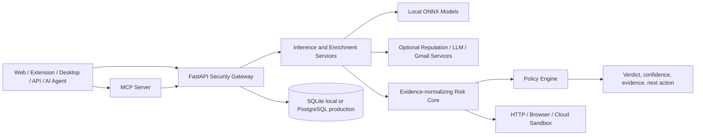

# Prewise

<p align="right"><strong>English</strong> · <a href="README.vi.md">Tiếng Việt</a></p>

**Pre-action risk control for people, applications, and AI agents.**

Prewise inspects untrusted URLs, messages, prompts, files, and planned actions
before they are opened, submitted, shared, or executed. It combines local ONNX
models, deterministic security rules, evidence normalization, and a policy
engine to return an explainable decision such as `ALLOW`, `WARN`,
`REQUIRE_REVIEW`, `SOFT_BLOCK`, or `HARD_BLOCK`.

The project is local-first: core URL, text, prompt, file, and policy paths can
run without a cloud AI provider. Optional reputation services, local or remote
LLMs, Gmail, malware scanning, and disposable cloud sandboxes extend the
available evidence when a deployment explicitly configures them.

> Prewise is a decision-support and risk-control system, not a replacement for
> a SOC, malware laboratory, or forensic deepfake analysis.

## Why Prewise

- **One Risk Core, multiple surfaces.** The same assessment and policy concepts
  are available through a Next.js web app, a Chrome Manifest V3 extension, a
  desktop client, REST APIs, and an MCP server for AI agents.
- **Evidence before verdict.** Results include the matched signals, coverage,
  confidence, reason codes, and a recommended next action instead of exposing
  only a classifier probability.
- **Models cannot silently overrule policy.** High-confidence model evidence can
  raise a warning, while confirmed blocking decisions remain governed by the
  policy layer and stronger evidence.
- **Graceful degradation.** Local heuristics and packaged ONNX models continue
  to work when an optional LLM, reputation provider, or enrichment service is
  unavailable.
- **Reproducible evaluation.** Release metrics are generated from a frozen,
  checksummed holdout and include ablations, confusion matrices, latency
  percentiles, artifact hashes, and misclassified samples.

## Capabilities

### Risk detection

| Area | What Prewise evaluates |
|---|---|
| URL and domain risk | URL structure, typosquatting and homoglyph signals, redirects, domain lifecycle and ownership evidence, TLS configuration, threat feeds, and optional reputation providers |
| Email, SMS, and text | Phishing intent, credential and payment pressure, impersonation patterns, malicious links, attachments, and model evidence |
| Prompt and tool-output injection | Instruction override attempts, unsafe tool output, data-exfiltration language, and downstream-use context |
| Agent actions | Target, action type, protected assets, policy context, and whether the action should proceed, warn, request confirmation, sandbox, or block |
| Files and executables | Bounded static inspection, magic bytes, hashes, entropy, PE metadata/imports, and explicit opt-in external reputation lookup |
| Web and cloud sandboxing | Isolated HTTP/browser inspection and disposable cloud analysis for uncertain or higher-risk cases |
| Image and sampled video screening | Local ONNX screening of still images and sampled video frames for AI-generated visual patterns |

### Product surfaces

- **Web application:** analysis workflows, history, reports, account controls,
  administration, model operations, and sandbox session UI.
- **Chrome extension:** page and Gmail scanning with minimal default permissions
  and optional host access.
- **Desktop client:** an Electron/Vite security client for local workflows.
- **REST gateway:** FastAPI endpoints for assessments, authentication,
  integrations, administration, telemetry, and sandbox lifecycle management.
- **MCP server:** 12 registered security tools over local `stdio` or authenticated
  Streamable HTTP, including URL/text/action assessment, prompt scanning,
  bounded file inspection, EXE quick scan, and safe risk summarization.

## Architecture



The main runtime boundaries are:

1. **Clients** collect an assessment request without embedding server secrets.
2. **Gateway and MCP authorization** validate identity, scope, quota, body size,
   and transport constraints.
3. **Inference and enrichment** combine local model output with available,
   provenance-aware evidence.
4. **Risk Core** normalizes findings, calculates risk and confidence, and keeps
   unavailable checks distinct from clean checks.
5. **Policy Engine** converts the evidence state into an enforceable decision
   and recommended next action.
6. **Sandbox services** handle uncertain web or executable cases outside the
   normal request process.

For deeper design details, see
[`docs/risk-detection-v3-design.md`](docs/risk-detection-v3-design.md),
[`docs/SECURITY_RISK_CORE_V3.md`](docs/SECURITY_RISK_CORE_V3.md), and
[`docs/agent-shield-integration.md`](docs/agent-shield-integration.md).

## Release benchmark

The frozen release set contains **7,022 holdout rows** across URL, email, SMS,
and prompt-injection arms. The URL arm is both source-disjoint and
registrable-domain-disjoint from the training source. Metrics below describe
the conservative `full_offline` product path, where a row is counted as flagged
when the user would visibly be interrupted by a warning or stronger decision.

| Holdout arm | Rows | Precision | Recall | F1 | FPR | p99 latency |
|---|---:|---:|---:|---:|---:|---:|
| URL phishing | 3,000 | 83.70% | 30.80% | 45.03% | 6.00% | 25.465 ms |
| Email phishing | 1,968 | 97.19% | 66.80% | 79.18% | 1.93% | 55.711 ms |
| Prompt injection | 662 | 96.30% | 19.77% | 32.81% | 0.50% | 0.848 ms |
| SMS scam\* | 1,392 | 95.73% | 52.34% | 67.67% | 2.00% | 18.574 ms |

Measured on Python 3.11.9 and ONNX Runtime 1.27.0 on a 16-logical-CPU Windows
machine. The release evidence also records **671 passing backend tests** at the
time of verification.

Important interpretation notes:

- \*The SMS evaluation source has a **high corpus-overlap risk**. Its absolute
  score must not be presented as evidence of generalization; it remains useful
  for within-dataset ablation comparisons.
- The full offline path intentionally favors precision and low false-positive
  rates. A low-recall result should be escalated to deeper inspection rather
  than described as proof that the input is safe.
- The URL full-offline evaluator scored 2,999 of 3,000 rows and recorded one
  processing error; the confusion matrix and percentages use the scored rows.
- The URL model alone reached **68.20% accuracy and 66.83% F1** on the frozen,
  unseen-domain holdout after domain-grouped retraining. In the product path,
  high-confidence model evidence is capped at `WARN`; it cannot block alone.
- Prompt Risk Core plus policy improved F1 from **26.23% for ML-only to 32.81%**
  on the same holdout. Email and SMS policy paths prioritize lower false-positive
  rates rather than claiming an F1 improvement over their raw classifiers.
- No reproducible unseen-generator holdout is packaged for AI-image screening,
  so Prewise does **not** publish an image/deepfake accuracy or F1 claim.
- Online enrichment has not yet been shown to improve the frozen URL holdout and
  is not included in the headline results.

Evidence and reproduction entry points:

- [`FINAL_BENCHMARK_2026.md`](FINAL_BENCHMARK_2026.md) — claim policy and release
  verification record.
- `artifacts/benchmarks/release-benchmark.{json,md}` — machine-generated metrics,
  environment, confusion matrices, and artifact hashes.
- `benchmarks/prewise_holdout/v1/manifest.json` — frozen dataset sources, row
  counts, overlap classifications, and SHA-256 checksums.
- `tools/benchmark_release.py` — evaluator used for the published table.

```bash
python -m tools.build_holdout --verify
python -m tools.benchmark_release
```

## Technology stack

| Layer | Main technologies |
|---|---|
| Backend | Python 3.11+, FastAPI, Pydantic, SQLAlchemy, Alembic |
| Local inference | ONNX Runtime, LightGBM, scikit-learn, Transformers |
| Web | Next.js 15, React 18, TypeScript, Tailwind CSS |
| Desktop | Electron, Vite, React, TypeScript |
| Browser | Chrome Extension Manifest V3 |
| Agent integration | Model Context Protocol, OAuth/API-key scopes, `stdio` and Streamable HTTP |
| Storage | Embedded SQLite for local use; PostgreSQL design and migrations for hosted deployment |
| Sandboxing | Bounded local workers, Playwright browser isolation, optional disposable AWS workers |
| Quality | Pytest, pytest-cov, Vitest, Testing Library, Ruff, ESLint, TypeScript |

Packaged runtime models include a LightGBM URL classifier, lightweight
TF-IDF/logistic-regression text and prompt classifiers, a quality-gated
transformer path, and a quantized local image-screening model. See
[`server/models/README.md`](server/models/README.md) for runtime selection and
quality gates.

## Quick start

### Prerequisites

- Python 3.11+
- Node.js 20+
- Docker with Compose, if using the containerized path
- At least 4 GB RAM for the base stack; local LLM and sandbox workloads may need
  substantially more

### Docker Compose

```bash
git clone https://github.com/VNDT1625/Prewise.git
cd Prewise
cp .env.example .env
docker compose up -d --build
```

On Windows PowerShell, use `Copy-Item .env.example .env` instead of `cp`.

The development compose file starts:

| Service | Local address | Purpose |
|---|---|---|
| Web | <http://localhost:3000> | Main product UI |
| Backend | <http://localhost:8000> | REST gateway |
| OpenAPI | <http://localhost:8000/docs> | Development API reference |
| MCP | <http://127.0.0.1:3001/mcp> | Streamable HTTP MCP endpoint |
| Ollama | <http://localhost:11434> | Optional local explanations |

Ollama is optional for risk decisions. To enable local generated explanations:

```bash
docker exec -it armor-ollama ollama pull qwen2.5:7b-instruct-q4_K_M
```

Stop the stack with `docker compose down`. The default local database is stored
in the `armor-data` Docker volume.

### Local development

```bash
git clone https://github.com/VNDT1625/Prewise.git
cd Prewise
python -m venv .venv
```

Activate the environment:

```powershell
# Windows PowerShell
.\.venv\Scripts\Activate.ps1
```

```bash
# Linux or macOS
source .venv/bin/activate
```

Install and run the backend:

```bash
pip install -e ".[dev,mcp]"
cp .env.example .env
uvicorn backend.main:app --reload --port 8000
```

In a second terminal, run the web application:

```bash
cd frontend/web
cp .env.local.example .env.local
npm ci
npm run dev
```

The embedded SQLite database at `.aisec-data/armor.db` is created automatically
on first start. See
[`docs/portable-local-deployment.md`](docs/portable-local-deployment.md) for
moving a local installation and
[`docs/postgresql-production-design.md`](docs/postgresql-production-design.md)
for the hosted database design.

### Chrome extension

1. Open `chrome://extensions`.
2. Enable **Developer mode**.
3. Choose **Load unpacked**.
4. Select `frontend/extension`.
5. Configure the backend URL and optional site access from the extension's
   options page.

### MCP server

For a local agent integration, `stdio` is the safest default:

```bash
python -m mcp_server.server
```

Example MCP client configuration:

```json
{
  "mcpServers": {
    "prewise": {
      "command": "python",
      "args": ["-m", "mcp_server.server"]
    }
  }
}
```

Authenticated Streamable HTTP is also available:

```bash
python -m mcp_server.server --transport streamable-http --host 127.0.0.1 --port 3001
```

Do not expose the MCP or backend process directly to the public Internet. Put
remote access behind HTTPS, authentication, an explicit allowlist, and a
deployment-owned access policy.

## Configuration

Copy `.env.example` to an untracked `.env` and change every development secret
before a shared or production deployment. Configuration is grouped into:

- **Core runtime:** `APP_ENV`, `DATABASE_URL`, `DATABASE_AUTO_CREATE`, CORS,
  request limits, API-key pepper, and seed-user behavior.
- **Explanation AI:** `LLM_PROVIDER`, `LLM_BASE_URL`, `LLM_API_KEY`,
  `OLLAMA_BASE_URL`, and model selection.
- **Context adapters and legal RAG:** adapter manifests, bounded contribution,
  immutable corpus manifests, and optional verification overlays.
- **Reputation and threat intelligence:** Google Safe Browsing, IPQualityScore,
  MISP, PhishTank, URLhaus, URLVet, IP/domain/phone intelligence, and local
  feeds. All are opt-in.
- **File and message analysis:** MetaDefender, private ClamAV, Tesseract OCR,
  Gmail OAuth, attachment budgets, and explicit sample-sharing consent.
- **Cloud sandbox and billing:** AWS isolation resources, short-lived broker
  access, SePay webhook verification, and session limits.

Run the provider-safe readiness check without printing secrets:

```bash
python -m scripts.check_integrations
```

See [`docs/external-integrations.md`](docs/external-integrations.md),
[`docs/context-adapters.md`](docs/context-adapters.md), and
[`docs/legal-rag-local.md`](docs/legal-rag-local.md) for provider-specific setup.

## Testing and quality gates

```bash
# Backend regression suite
python -m pytest -q

# Backend coverage report (no current percentage is claimed in this README)
python -m pytest --cov=. --cov-report=term-missing

# Python lint
ruff check .

# Web tests, type checking, lint, and production build
cd frontend/web
npm test
npm run typecheck
npm run lint
npm run build
```

For model and release evaluation, use the frozen-holdout commands in the
[Release benchmark](#release-benchmark) section. Do not substitute training-set
or random-split metadata for an independent release claim.

## Repository structure

```text
.
├── ai/                    # Model adapters, inference, training, and ONNX artifacts
├── backend/               # FastAPI gateway, routers, middleware, services, and DB
├── benchmarks/            # Frozen release holdout and manifests
├── frontend/
│   ├── web/               # Next.js application
│   ├── desktop/           # Electron client
│   └── extension/         # Chrome Manifest V3 extension
├── mcp_server/            # MCP tools, scopes, OAuth, transports, and auditing
├── migrations/            # Alembic database migrations
├── security/              # Risk Core, policy, evidence, adapters, and sandboxes
├── server/                # Runtime model and contextual-adapter manifests
├── shared/                # Shared schemas and constants
├── tests/                 # Python unit and integration/regression tests
├── tools/                 # Dataset, benchmark, audit, and release utilities
└── docs/                  # Architecture, deployment, security, and operator guides
```

Start with [`docs/README.md`](docs/README.md) for the documentation map.

## Security and privacy

- Production configuration rejects unsafe secrets and an unsupported SQLite
  production configuration instead of silently starting insecurely.
- API keys and sessions are stored as hashes; Gmail tokens require configured
  encryption keys; MCP tools enforce scopes, quotas, and audit records.
- Endpoint-specific request-size limits, CORS restrictions, security headers,
  and application rate limits provide origin-side safety controls.
- External services are optional. Sample upload for EXE reputation analysis is
  disabled unless the caller explicitly requests it and has the required scope.
- In external LLM mode, the server is designed to send an allow-listed security
  context rather than raw user content. The selected provider's own retention
  policy still applies.
- Unavailable detectors reduce coverage/confidence; they are not treated as
  proof that an input is clean.

For the detailed trust boundaries, deployment gaps, and acceptance gates, read
[`docs/production-security-resilience.md`](docs/production-security-resilience.md),
[`docs/browser-sandbox.md`](docs/browser-sandbox.md), and
[`docs/release-operations.md`](docs/release-operations.md). Security issues
should be reported privately to the repository owner rather than disclosed with
working exploit details in a public issue.

## Limitations and roadmap

Current limitations are intentionally explicit:

- The current demo/release topology is not a demonstrated highly available
  production service. Production still requires redundant origins and tunnels,
  distributed rate limiting, managed database recovery, centralized
  observability, and exercised incident runbooks.
- AI-image and sampled-video screening is a visual heuristic, not forensic
  deepfake detection. It does not analyze audio or temporal consistency, and a
  reproducible unseen-generator benchmark remains open.
- The SMS release arm cannot establish generalization because source overlap
  could not be ruled out.
- External enrichment quality and expensive-path capacity require dedicated,
  representative staging evaluations; health-endpoint load tests are not a
  substitute.
- Missing providers intentionally produce a degraded or unavailable state.
  Operators must inspect coverage and confidence before treating an `ALLOW`
  result as sufficient for a high-impact action.

Near-term engineering priorities are to close those evidence gaps, move
expensive analysis to bounded worker queues, validate failover and restore
objectives, and publish reproducible image-screening and provider ablations.

## Contributing

Focused issues and pull requests are welcome. Before submitting a change:

1. Keep the change scoped and document any new trust boundary or provider.
2. Add regression tests for behavior changes.
3. Run the relevant Python and/or frontend quality gates.
4. Never commit `.env`, credentials, private datasets, customer samples, or
   generated local databases.
5. Update benchmark evidence only through the reproducible evaluator.

## License and third-party attribution

This repository does not currently contain a project-wide license grant. Until
the owner adds one, source reuse and redistribution are not automatically
permitted merely because the repository is public.

Third-party model and dependency licenses remain their respective owners'. See
[`THIRD_PARTY_NOTICES.md`](THIRD_PARTY_NOTICES.md) and `licenses/`. In
particular, the packaged AI-image screening model is attributed there under the
Apache License 2.0; that notice does not license the entire Prewise codebase.

## Acknowledgments

Prewise builds on FastAPI, Next.js, React, ONNX Runtime, LightGBM,
scikit-learn, Hugging Face Transformers, the Model Context Protocol, Playwright,
and Ollama, together with the public dataset sources recorded in the frozen
holdout manifest.

---

**Prewise: inspect first, act with evidence.**
