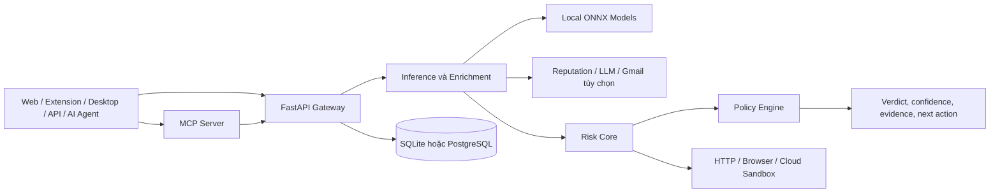

# Prewise

<p align="right"><a href="README.md">English</a> · <strong>Tiếng Việt</strong></p>

**Kiểm soát rủi ro trước hành động dành cho người dùng, ứng dụng và AI agent.**

Prewise phân tích URL, tin nhắn, prompt, tệp và hành động dự kiến trước khi chúng được mở, gửi, chia sẻ hoặc thực thi. Hệ thống kết hợp mô hình ONNX chạy cục bộ, luật bảo mật xác định, chuẩn hóa bằng chứng và policy engine để trả về quyết định có thể giải thích như `ALLOW`, `WARN`, `REQUIRE_REVIEW`, `SOFT_BLOCK` hoặc `HARD_BLOCK`.

Kiến trúc local-first cho phép các luồng URL, văn bản, prompt, tệp và policy hoạt động mà không cần nhà cung cấp AI cloud. Những tích hợp tùy chọn như reputation service, LLM, Gmail, quét malware và cloud sandbox bổ sung bằng chứng khi deployment chủ động bật chúng.

> Prewise là hệ thống hỗ trợ quyết định và kiểm soát rủi ro, không thay thế SOC, phòng phân tích malware hoặc quy trình giám định deepfake chuyên nghiệp.

## Điểm nổi bật

- **Một Risk Core, nhiều bề mặt:** web, Chrome Extension Manifest V3, Electron desktop, REST API và MCP server dùng chung mô hình đánh giá và policy.
- **Bằng chứng trước kết luận:** kết quả bao gồm signal, coverage, confidence, reason code và hành động tiếp theo thay vì chỉ trả về xác suất.
- **Model không tự ghi đè policy:** bằng chứng từ model có thể nâng cảnh báo, nhưng quyết định chặn vẫn thuộc policy layer và bằng chứng mạnh hơn.
- **Graceful degradation:** heuristic và ONNX model cục bộ tiếp tục hoạt động khi LLM hoặc dịch vụ enrichment không khả dụng.
- **Đánh giá tái lập:** benchmark dùng frozen holdout có checksum, confusion matrix, latency percentile, artifact hash và mẫu phân loại sai.

## Phạm vi phát hiện

| Nhóm | Nội dung đánh giá |
|---|---|
| URL và domain | Cấu trúc URL, typosquatting, homoglyph, redirect, vòng đời domain, TLS, threat feed và reputation provider tùy chọn |
| Email, SMS và văn bản | Phishing intent, credential/payment pressure, impersonation, link và attachment đáng ngờ |
| Prompt injection | Instruction override, tool output không an toàn, ngôn ngữ exfiltration và downstream context |
| Hành động của agent | Target, loại hành động, protected asset, policy context và quyết định tiếp tục/xác nhận/sandbox/chặn |
| Tệp và executable | Magic byte, hash, entropy, PE metadata/import và external reputation theo cơ chế opt-in |
| Web/cloud sandbox | Cô lập HTTP/browser hoặc disposable cloud worker cho trường hợp chưa chắc chắn |
| Hình ảnh/video | ONNX screening cục bộ trên ảnh và frame video được lấy mẫu |

## Kiến trúc



Luồng chính gồm xác thực request, kết hợp inference với enrichment, chuẩn hóa bằng chứng, chuyển evidence state thành quyết định policy và cô lập các trường hợp rủi ro cao khỏi request process thông thường.

## Benchmark release

Release evaluator đo **7.022 mẫu holdout** trên bốn nhánh URL, email, SMS và prompt injection. Nhánh URL được tách cả theo nguồn và registrable domain so với dữ liệu huấn luyện.

| Holdout | Số mẫu | Precision | Recall | F1 | FPR | p99 |
|---|---:|---:|---:|---:|---:|---:|
| URL phishing | 3.000 | 83,70% | 30,80% | 45,03% | 6,00% | 25,465 ms |
| Email phishing | 1.968 | 97,19% | 66,80% | 79,18% | 1,93% | 55,711 ms |
| Prompt injection | 662 | 96,30% | 19,77% | 32,81% | 0,50% | 0,848 ms |
| SMS scam* | 1.392 | 95,73% | 52,34% | 67,67% | 2,00% | 18,574 ms |

Môi trường đo: Python 3.11.9, ONNX Runtime 1.27.0 và máy Windows 16 logical CPU. Release evidence đồng thời ghi nhận **671 backend tests pass** tại thời điểm xác minh.

Lưu ý khi diễn giải:

- *Nguồn đánh giá SMS có nguy cơ trùng corpus cao; không dùng điểm tuyệt đối để chứng minh khả năng tổng quát hóa.
- Full-offline path ưu tiên precision và FPR thấp. Recall thấp không đồng nghĩa input an toàn và nên được chuyển sang kiểm tra sâu hơn.
- URL model đạt 68,20% accuracy và 66,83% F1 trên unseen-domain holdout; model evidence một mình chỉ được nâng tối đa đến `WARN`.
- Repository chưa có unseen-generator holdout tái lập cho AI-image screening, vì vậy không công bố accuracy/F1 cho deepfake image.

Xem [`FINAL_BENCHMARK_2026.md`](FINAL_BENCHMARK_2026.md) và chạy:

```bash
python -m tools.build_holdout --verify
python -m tools.benchmark_release
```

## Công nghệ

| Lớp | Công nghệ chính |
|---|---|
| Backend | Python 3.11+, FastAPI, Pydantic, SQLAlchemy, Alembic |
| Inference | ONNX Runtime, LightGBM, scikit-learn, Transformers |
| Web/Desktop | Next.js, React, TypeScript, Electron, Vite |
| Browser | Chrome Extension Manifest V3 |
| Agent | Model Context Protocol, API key/OAuth scope, stdio và Streamable HTTP |
| Storage | SQLite cục bộ, PostgreSQL cho hosted deployment |
| Quality | Pytest, pytest-cov, Vitest, Ruff, ESLint, TypeScript |

## Chạy nhanh

Yêu cầu Python 3.11+, Node.js 20+ và Docker Compose nếu dùng container:

```bash
git clone https://github.com/VNDT1625/Security.git
cd Security
cp .env.example .env
docker compose up -d --build
```

Trên PowerShell dùng `Copy-Item .env.example .env`. Web chạy tại `http://localhost:3000`, backend tại `http://localhost:8000` và OpenAPI tại `http://localhost:8000/docs`.

## Testing

```bash
pytest
pytest --cov
ruff check .

cd frontend/web
npm test
npm run type-check
npm run lint
npm run build
```

## Giới hạn hiện tại

- Benchmark online enrichment chưa chứng minh cải thiện trên frozen URL holdout.
- Recall của một số nhánh conservative policy còn thấp và cần deep-inspection path.
- Image/deepfake screening chưa có benchmark unseen-generator đủ để công bố chất lượng.
- Optional integrations phụ thuộc credential, network và policy của deployment.

## License

Repository hiện chưa có project-wide license. Không mặc định xem source là open source hoặc được phép tái phân phối. Các model và dependency bên thứ ba vẫn tuân theo license riêng của chúng.
