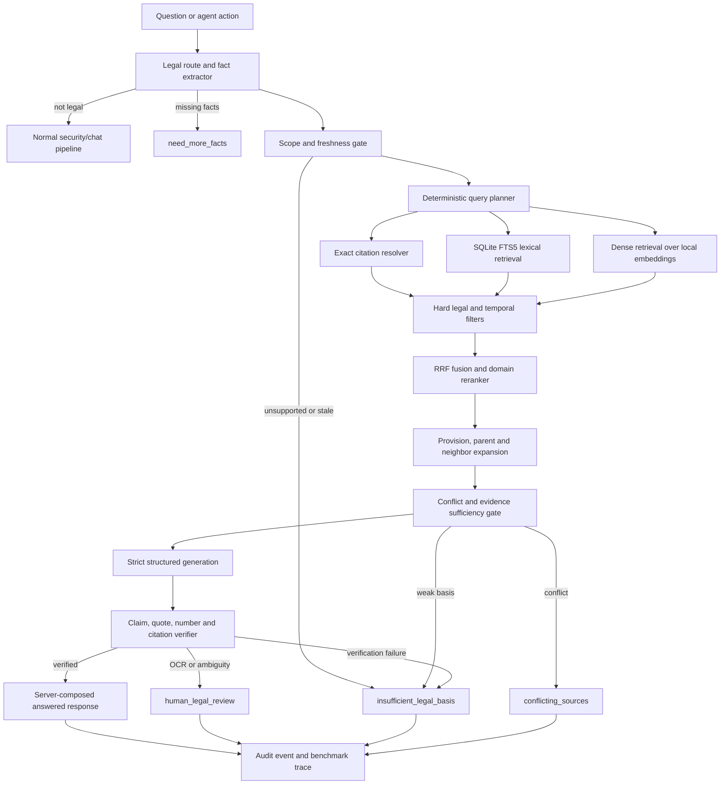

# Prewise Legal RAG v2 — Design, Demo and Benchmark

**Trạng thái:** Proposed — design-first, chưa triển khai runtime  
**Ngày thiết kế:** 2026-07-22  
**Phạm vi:** câu trả lời pháp luật Việt Nam và kiểm tra hành động agent  
**Corpus baseline:** `data/legal_rag/rag.sqlite3`  
**Corpus SHA-256:** `AA4F033E3CAB2C6A32772AD19C1E78A26790B59F840BCD0309962A700FA87381`

## 1. Quyết định kiến trúc

Legal RAG v2 là một **evidence engine có khả năng từ chối**, không phải một chatbot
được huấn luyện để ghi nhớ luật.

Luồng mục tiêu:

```text
legal routing + fact completeness
→ corpus scope/freshness gate
→ exact citation + lexical + dense retrieval
→ temporal/legal hard filters
→ rank fusion + multilingual reranker
→ provision/neighbor context expansion
→ structured generation
→ claim-level deterministic verification
→ answered hoặc fail-closed state
```

Các quyết định bắt buộc:

1. Không fine-tune nội dung luật làm nguồn sự thật.
2. Không truy cập web trong đường xử lý câu hỏi. Việc cập nhật corpus là pipeline riêng.
3. Không dùng vector database ở phiên bản đầu. Với 3.281 chunks, ma trận embedding
   memory-mapped và cosine bằng NumPy/ONNX đơn giản hơn, dễ đóng gói và đủ nhanh.
4. Giữ SQLite FTS5 cho exact/lexical retrieval; thêm dense retrieval và reranker,
   không thay thế lexical retrieval.
5. Model không được tự tạo citation metadata và không quyết định citation có hợp lệ.
6. Câu trả lời hiển thị được dựng từ các claim đã qua verifier; không tin trực tiếp
   trường `answer` tự do do model sinh.
7. Chỉ nguồn có hiệu lực, đúng phạm vi và đủ legal weight mới được hỗ trợ kết luận
   có tính bắt buộc.
8. Legal RAG không được hạ mức quyết định của Risk Core hoặc PolicyEngine.
9. Mọi kết quả phải gắn `corpus_release_id` và `verified_through` để không tạo ấn tượng
   corpus đúng vĩnh viễn.

## 2. Baseline đã kiểm tra

### 2.1 Corpus hiện tại

| Thuộc tính | Giá trị baseline |
| --- | ---: |
| Văn bản | 17 |
| Tổng chunks | 3.281 |
| `retrieval_default=1` | 2.908 |
| Thực tế searchable bởi SQL hiện tại | 2.692 chunks / 14 văn bản VN |
| Binding, retrieval mặc định | 2.643 |
| Policy strategy Việt Nam | 49 |
| OCR chunks | 2.540 (77,4%) |
| OCR trong tập searchable hiện tại | 2.540 / 2.692 (94,35%) |
| Native PDF text chunks | 741 (22,6%) |
| Native PDF text trong tập searchable hiện tại | 152 |
| Chunks ngắn hơn 40 ký tự | 136 |
| Ngày kiểm tra trạng thái | 2026-07-22 cho toàn corpus |
| Dung lượng SQLite | khoảng 10,5 MiB |

Corpus bao phủ các nhóm chính: dữ liệu cá nhân, AI, an ninh mạng, trẻ em, dữ liệu,
giao dịch điện tử, sở hữu trí tuệ và một số tài liệu quản trị AI. Corpus **không phải
bộ pháp luật Việt Nam đầy đủ**; ví dụ thuế, lao động, đất đai và hình sự không nằm
trong scope hiện tại.

`topics` hiện chủ yếu được gán ở cấp văn bản nên có ích cho routing theo domain nhưng
chưa đủ để phân biệt chính xác các điều/khoản trong cùng văn bản.

### 2.2 Runtime hiện tại

- `LocalLegalRAG` dùng SQLite FTS5/BM25 và nối tối đa 24 token bằng `OR`.
- `LegalAnswerService` đã có routing, lọc trạng thái, structured JSON cơ bản và
  kiểm tra chunk id.
- `InferenceService.assess_action()` đã bảo đảm Legal RAG chỉ có thể làm quyết định
  thận trọng hơn.
- 12 test liên quan trực tiếp đến Legal RAG và Legal Answer đang pass.

Một canary thủ công 8 câu, chưa được legal reviewer thẩm định và không được coi là
benchmark chính thức, cho thấy query đúng như `LegalAnswerService` chỉ đạt Recall@8
12,5% và MRR@8 0,042. Rerank hiện chỉ chạy trong top 8 nên không thể cứu passage đúng
đã bị candidate generation loại. Kết quả này là tín hiệu P0 để xây gold benchmark trước
khi tuyên bố chất lượng.

Hai technical hero probes khác cho thấy passage cần thiết đã có trong corpus nhưng bị
query hiện tại làm chìm:

- “Đưa dữ liệu khách hàng sang máy chủ Singapore”: passage cross-border đúng ở rank 136,
  passage nghĩa vụ ở rank 1.168; focused legal phrase đưa passage đúng lên rank 1.
- “Dùng tác phẩm có bản quyền để huấn luyện mô hình”: passage trực tiếp ở rank 12 và
  passage điều kiện ở rank 39, đều bị cap top 8 loại; focused query đưa chúng lên rank 1–2.

Do đó P0 là query planner + candidate recall + filter-before-limit. Dense retrieval hữu
ích cho paraphrase, nhưng không thể sửa một query plan nhiễu nếu đứng một mình.

Smoke latency của FTS hiện tại trên máy phát triển, 300 lượt truy vấn sau warm-up:

| Metric | Giá trị |
| --- | ---: |
| p50 | 34,8 ms |
| p95 | 46,3 ms |
| p99 | 55,5 ms |

Đây chỉ là số đo khảo sát, chưa phải benchmark công bố vì chưa gắn cấu hình phần cứng,
gold labels và confidence interval.

### 2.3 Khoảng trống phải xử lý

1. Explicit legal mode vẫn có thể bị regex classifier bỏ qua.
2. Một chunk id có thật nhưng không liên quan vẫn có thể được dùng để “rửa citation”.
3. Một citation cho một claim có thể làm cả đoạn trả lời nhiều claim vượt qua hậu kiểm.
4. `legal_weight=policy_strategy` vẫn có thể hỗ trợ claim “phải/bị cấm”.
5. Thiếu `status_checked_at` đang có nguy cơ bị thay bằng ngày người dùng yêu cầu.
6. `conflicting_sources` chưa được phát hiện tất định và đang bị collapse thành
   `human_legal_review`.
7. Mọi nguồn OCR đều chuyển review, nhưng nội dung model sinh vẫn có thể được hiển thị.
8. Không có out-of-scope/relevance calibration; FTS luôn trả candidates nếu có token chung.
9. Không có gold retrieval benchmark nên chưa thể chứng minh RAG “mạnh hơn”.
10. Legal generation chưa có quota/audit trace hoàn chỉnh; WebSocket legal response có
    thể để trống message id.
11. Có 728 chunks dài hơn preview 700 ký tự; heuristic rerank hiện không thấy phần text
    bị cắt, và heading/article context có thể nằm ở chunk lân cận.

## 3. Mục tiêu và phi mục tiêu

### 3.1 Mục tiêu

- Tìm đúng điều/khoản liên quan cho câu hỏi tiếng Việt tự nhiên, kể cả paraphrase,
  từ viết tắt, câu không dấu và exact legal citation.
- Có khả năng biết corpus không bao phủ hoặc bằng chứng không đủ.
- Lọc đúng hiệu lực tại `as_of_date` và không dùng ngày kiểm tra trạng thái giả.
- Kiểm chứng từng claim, quote, số liệu và citation bằng code.
- Có benchmark tái lập được, so sánh baseline/ablation và có release gates.
- Có demo vừa cho thấy happy path vừa cho thấy fail-closed path.
- Chạy local/offline trên demo laptop; có quality profile cho máy GPU.

### 3.2 Phi mục tiêu

- Không tuyên bố tư vấn pháp lý chính thức.
- Không tự suy luận để giải quyết xung đột pháp luật phức tạp.
- Không suy ra “được phép” từ việc không tìm thấy điều cấm.
- Không tuyên bố bao phủ ngoài danh mục văn bản của corpus release.
- Không dùng LLM-as-a-judge làm metric chính để tự chấm chính model đó.
- Không tự động cho phép agent thực hiện hành động chỉ vì tìm thấy reference.

## 4. Safety invariants

Các invariant sau phải được test như thuộc tính hệ thống:

```text
missing/invalid corpus                 → không answered
as_of_date > verified_through          → không answered
unsupported jurisdiction/domain       → không answered
normative claim without binding basis → không answered
unknown citation id                    → không answered
quote not present in cited provision  → không answered
number/date not present in evidence   → không được hiển thị số/date đó
unverified OCR as sole basis           → human_legal_review
potential source conflict             → conflicting_sources
Risk Core BLOCK                        → Legal RAG không thể hạ quyết định
```

`answered` chỉ là trạng thái kỹ thuật cho biết mọi claim đã vượt các gate trong phạm
vi corpus, không đồng nghĩa với bảo đảm pháp lý tuyệt đối.

## 5. Kiến trúc tổng thể



## 6. Corpus release và ingestion

Retrieval mạnh bắt đầu từ corpus sạch. Không thêm dense model lên trên chunks OCR lỗi
rồi coi đó là giải pháp hoàn chỉnh.

### 6.1 Immutable release bundle

Mỗi release được đóng gói như sau:

```text
legal_rag/releases/<release_id>/
├── manifest.json
├── rag.sqlite3
├── embeddings.f16.npy
├── embedding_ids.json
├── model-manifest.json
└── validation-report.json
```

`manifest.json` tối thiểu chứa:

```json
{
  "schema_version": 2,
  "corpus_release_id": "vn-legal-2026-07-22.1",
  "jurisdictions": ["VN"],
  "verified_through": "2026-07-22",
  "coverage_domains": ["personal_data", "ai", "cybersecurity"],
  "source_revision": "pinned-hugging-face-commit",
  "sqlite_sha256": "...",
  "embedding_model_id": "...",
  "embedding_model_revision": "...",
  "embedding_dimension": 1024,
  "chunk_count": 3281,
  "document_count": 17
}
```

Download phải pin `--revision <commit-sha>`, kiểm tra SHA-256, schema, row counts,
FTS integrity, provenance URL và model revision trước khi kích hoạt. Release mới được
đưa vào thư mục riêng; chỉ thay atomic `current-release.json` sau khi validator pass.
Giữ tối thiểu một last-known-good release để rollback.

### 6.2 Provision-first representation

Thay chunking thuần độ dài bằng hierarchy pháp lý:

```text
document
└── chapter
    └── article
        └── clause
            └── point
```

Mỗi provision có stable id, original text, normalized search text, heading path,
page range, source hash và quan hệ parent/neighbor. Chunk retrieval có thể chứa một
hoặc nhiều provision nhỏ, nhưng citation luôn quay về provision cụ thể.

Không index độc lập các mảnh OCR rác hoặc heading quá ngắn. Chunks dưới ngưỡng phải
được merge với provision cha/lân cận hoặc đặt `retrievable=0`.

### 6.3 Text provenance và OCR

Ưu tiên theo thứ tự:

1. Native text từ nguồn chính thức có thể đối chiếu PDF.
2. Official HTML/DOC/DOCX được căn chỉnh lại trang PDF.
3. OCR đã được human verification.
4. OCR chưa kiểm chứng chỉ phục vụ candidate discovery, không làm sole basis cho
   trạng thái `answered`.

Thêm các trường:

```text
text_source_type
ocr_confidence
text_verification_status
verified_against_pdf_at
verified_by
quote_hash
```

Để demo có happy path trung thực, cần human-verify một tập provision trọng yếu về
dữ liệu cá nhân, AI, an ninh mạng và bản quyền. Tập này không được trùng toàn bộ với
benchmark hidden set.

### 6.4 Temporal và relationship graph

`status=current` không đủ. Schema cần:

```text
effective_from
effective_to
status_verified_at
validity_precision
amends
repeals
supersedes
implements
exception_to
cross_references
affected_provision_ids
```

Runtime chỉ dùng provision khi:

```text
effective_from <= as_of_date
AND (effective_to IS NULL OR as_of_date < effective_to)
AND status_verified_at >= as_of_date
```

Nếu `status_verified_at < as_of_date`, hệ thống trả corpus stale; tuyệt đối không thay
ngày kiểm tra bằng `as_of_date`.

## 7. Query routing và fact completeness

Thứ tự ưu tiên routing:

1. `mode="legal"` do UI/API gửi rõ ràng.
2. Có `legal_context` hoặc action gate gọi trực tiếp.
3. Hybrid legal intent detector cho chế độ tự động.

Classifier không được chặn explicit legal mode. Detector phải bao phủ câu hỏi như:

```text
Có thể thu thập dữ liệu này không?
Công ty được chia sẻ CCCD khách hàng không?
Tôi có quyền yêu cầu xóa dữ liệu không?
Ai chịu trách nhiệm nếu dữ liệu bị lộ?
Mức xử phạt trong trường hợp này là bao nhiêu?
```

Context tối thiểu vẫn gồm jurisdiction, as-of date, actor, action và asset, nhưng việc
bắt buộc phải phụ thuộc loại câu hỏi. Ví dụ câu hỏi định nghĩa có thể không cần actor;
câu hỏi permission/obligation cần actor và hành động cụ thể.

Không tự suy đoán dữ kiện làm thay đổi kết luận. Server có thể mặc định ngày hiện tại
chỉ khi UI hiển thị rõ và người dùng có thể sửa; jurisdiction không được suy ra âm thầm
từ ngôn ngữ câu hỏi.

## 8. Strong hybrid retrieval

### 8.1 Deterministic query planner

Planner tạo các query views giới hạn, không đưa nguyên câu hỏi dài vào một phép OR:

```text
exact citation view
core legal concepts view
actor/action/asset view
controlled synonym/abbreviation view
accent-preserving + accentless shadow view
```

Giữ nguyên từ phủ định. Expansion chỉ dùng dictionary versioned và benchmarked;
LLM rewrite nếu có chỉ là candidate bổ sung, không thay query gốc.

Ví dụ alias:

```text
AI ↔ trí tuệ nhân tạo
CCCD ↔ căn cước công dân ↔ dữ liệu định danh
xóa ↔ hủy dữ liệu
bên thứ ba ↔ bên nhận dữ liệu
```

Alias phải được legal reviewer duyệt vì các thuật ngữ gần nghĩa không phải lúc nào
cũng có cùng hệ quả pháp lý.

### 8.2 Candidate generators

| Retriever | Vai trò | Candidate mặc định |
| --- | --- | ---: |
| Exact resolver | Số hiệu + Điều/Khoản/Điểm | tối đa 10 |
| FTS5/BM25 | Exact terms, phrases, legal vocabulary | top 50 |
| Dense | Paraphrase và semantic recall | top 50 |
| Cross-reference expansion | Provision được viện dẫn trực tiếp | giới hạn 10 |

Các con số là điểm khởi đầu; benchmark validation set quyết định cấu hình cuối.

FTS query dùng phrase và nhóm bắt buộc khi có thể, thay vì `OR` toàn bộ token. Document
number/article lookup đi qua exact resolver trước BM25.

Dense vectors được tính offline, normalized và lưu float16. Với khoảng 3.000–20.000
chunks, brute-force matrix multiplication đủ đơn giản và tái lập. Chỉ chuyển sang HNSW
khi corpus vượt ngưỡng benchmarked, dự kiến từ khoảng 100.000 chunks trở lên.

### 8.3 Hard filters trước ranking cuối

- Eligibility mask phải được áp dụng bên trong từng candidate generator, trước `LIMIT`
  hoặc top-k, rồi được recheck sau fusion. Nguồn không hợp lệ không được chiếm candidate
  slots và đẩy evidence đúng ra ngoài pool.
- Jurisdiction chính xác.
- Corpus domain coverage.
- Temporal validity tại `as_of_date`.
- `retrievable=1` và provenance hợp lệ.
- Legal weight phù hợp với claim intent.
- Source/checksum thuộc release hiện hành.
- OCR verification state.

Filter không được dựa chỉ vào model score.

### 8.4 Fusion, reranking và diversity

Gộp lexical/dense bằng Reciprocal Rank Fusion để không cần giả định hai score cùng
thang đo. Rerank top 20–30 candidates bằng multilingual cross-encoder với input:

```text
question + actor/action/asset + title + heading path + provision text
```

Reranker dùng provision text đầy đủ trong giới hạn model, không dùng `text_preview[:700]`.

Sau rerank:

- Giới hạn duplicate provision.
- Bảo đảm diversity giữa luật gốc, văn bản hướng dẫn và exception liên quan.
- Expand parent/neighbor sau khi chọn evidence, không trước khi rerank.
- Context pack mặc định 4–8 provisions, có token budget và provenance đầy đủ.

### 8.5 Model bake-off, không chọn bằng cảm tính

Các ứng viên ban đầu:

- Quality candidate: [BAAI/bge-m3](https://huggingface.co/BAAI/bge-m3) cho dense
  retrieval và [BAAI/bge-reranker-v2-m3](https://huggingface.co/BAAI/bge-reranker-v2-m3)
  cho reranking.
- Portable baseline: [intfloat/multilingual-e5-base](https://huggingface.co/intfloat/multilingual-e5-base)
  export ONNX/int8.
- Lexical baseline: SQLite FTS5 hiện tại.

Model chỉ được chọn sau benchmark tiếng Việt pháp lý, latency và memory trên máy demo.
Revision, checksum, license và export settings phải được pin trong model manifest.
Nếu dense encoder hoặc reranker lỗi, response phải ghi `retrieval_mode=lexical_degraded`;
pipeline không được âm thầm coi lexical fallback có cùng độ tin cậy và vẫn phải qua
sufficiency/fail-closed gates.

## 9. Relevance, coverage và abstention

Retriever luôn có thể trả một “top result”, kể cả khi câu hỏi ngoài scope. Vì vậy top-1
không đồng nghĩa có căn cứ.

Sufficiency gate dùng các feature đã calibration:

```text
exact citation match
reranker relevance
lexical/dense agreement
provision-level term coverage
document/domain match
score margin top1-topN
legal weight
temporal validity
```

Threshold được fit trên validation set và khóa trước hidden test. Nếu dưới threshold:

```text
status = insufficient_legal_basis
reason_code = low_relevance | corpus_out_of_scope
```

Không cho model tự vượt threshold.

## 10. Structured generation và claim verifier

### 10.1 Model output contract

Model trả strict schema, `extra="forbid"`:

```json
{
  "status": "answered",
  "claims": [
    {
      "claim_id": "claim-1",
      "claim_type": "obligation",
      "text": "Kết luận pháp lý có giới hạn.",
      "evidence": [
        {
          "provision_id": "vn_personal_data_91_2025::article-20::clause-1",
          "chunk_id": "vn_personal_data_91_2025::c00084",
          "quote": "Đoạn nguyên văn hỗ trợ claim"
        }
      ]
    }
  ],
  "missing_facts": [],
  "uncertainties": [],
  "requires_human_review": false
}
```

Model không được trả title, document number, page, effective date hoặc source URL như
nguồn sự thật. Backend hydrate toàn bộ metadata này từ release DB.

Không stream draft của model trước hậu kiểm. WebSocket chỉ bắt đầu gửi nội dung sau khi
claim verifier hoàn tất và backend đã dựng response an toàn.

### 10.2 Deterministic verification order

1. Validate strict JSON schema, enum, length và count limits.
2. Mọi provision/chunk id phải nằm trong context đã cấp.
3. `quote` phải là exact normalized substring của provision.
4. Mỗi claim phải có evidence riêng; không dùng citation toàn cục.
5. Normative/penalty/permission claim phải có binding source phù hợp.
6. Số tiền, phần trăm, thời hạn, ngày, điều/khoản và document number xuất hiện trong
   claim phải tồn tại trong evidence tương ứng.
7. Recheck temporal validity và `status_verified_at` từ DB.
8. Detect negation mismatch và obvious contradiction.
9. Optional NLI/semantic verifier chỉ có quyền hạ xuống review/reject, không có quyền
   tự phê duyệt claim đã trượt deterministic checks.
10. Dựng answer hiển thị từ claims đã pass và citation metadata do server cấp.

Một claim trượt không được âm thầm giữ trong prose. Tùy mức độ, toàn response chuyển
`insufficient_legal_basis` hoặc `human_legal_review`.

### 10.3 Conflict handling

Conflict detector dùng relation graph, overlapping scope và incompatibility flags để
phát hiện potential conflict. Backend không tự áp dụng các học thuyết ưu tiên pháp luật
trừ khi rule đã được legal reviewer mã hóa và test.

Giữ nguyên:

```text
status = conflicting_sources
requires_human_review = true
```

Không collapse thành trạng thái khác; `reason_code` mô tả loại conflict.

## 11. API contract mục tiêu

Tạo application endpoint độc lập `POST /v1/legal/answers`; WebSocket chat chỉ là adapter
gọi cùng service để benchmark không phụ thuộc UI/stream transport.

### 11.1 Request

```json
{
  "schema_version": "legal-answer.v2",
  "request_id": "uuid",
  "idempotency_key": "opaque",
  "intent_mode": "legal",
  "question": "Doanh nghiệp có được chuyển dữ liệu này cho nhà cung cấp không?",
  "legal_context": {
    "jurisdiction": "VN",
    "as_of_date": "2026-07-22",
    "actor": "doanh nghiệp",
    "action": "chuyển dữ liệu cho nhà cung cấp",
    "data_or_asset": "dữ liệu cá nhân khách hàng",
    "recipient": "nhà cung cấp dịch vụ",
    "purpose": "vận hành hệ thống",
    "consent_state": "unknown"
  }
}
```

`intent_mode` chỉ cho `auto | legal`. Client không được ép `normal` để né legal router;
có `legal_context` phải force legal pipeline.

Các trường sau `data_or_asset` là optional nhưng có thể trở thành missing facts tùy
loại kết luận.

### 11.2 Response

Giữ các status tương thích hiện tại:

```text
answered
need_more_facts
insufficient_legal_basis
conflicting_sources
human_legal_review
```

Thêm các trường:

```json
{
  "reason_code": "verified | low_relevance | corpus_stale | corpus_out_of_scope | unsupported_claim | unverified_ocr | conflict",
  "corpus": {
    "release_id": "vn-legal-2026-07-22.1",
    "verified_through": "2026-07-22",
    "coverage_domains": ["personal_data", "ai"]
  },
  "trace_id": "opaque-id",
  "claims": [],
  "citations": [],
  "missing_facts": [],
  "uncertainties": [],
  "requires_human_review": false
}
```

Retrieval scores và full trace chỉ trả ở debug/admin endpoint, không đưa vào response
người dùng như một “xác suất hợp pháp”.
`candidate_sources` chỉ dùng trong debug/audit và không được trình bày như citation hỗ
trợ kết luận. Với mọi status khác `answered`, UI chỉ hiển thị server-authored safe template,
không hiển thị raw prose chưa được verify của model.

## 12. State machine

| Điều kiện | Trạng thái |
| --- | --- |
| Không phải legal và không explicit legal mode | normal pipeline |
| Thiếu fact có ảnh hưởng kết luận | `need_more_facts` |
| Jurisdiction/domain không hỗ trợ | `insufficient_legal_basis` |
| Corpus thiếu, lỗi hoặc stale | `insufficient_legal_basis` |
| Không có candidate vượt threshold | `insufficient_legal_basis` |
| Nguồn có potential conflict | `conflicting_sources` |
| Chỉ có OCR chưa verified hoặc quan hệ sửa đổi chưa rõ | `human_legal_review` |
| Model/citation/quote verification trượt | `insufficient_legal_basis` |
| Mọi claim vượt tất cả gate | `answered` |

Mọi nhánh đều có `reason_code`, audit event và corpus release id.

### 12.1 Contract riêng cho action gate

Action assessment không dùng các trạng thái như `allow` hoặc `lawful`. Legal layer chỉ
trả evidence state:

```text
not_applicable
reference_found
review_required
insufficient_basis
conflict_detected
```

`PolicyEngine` nhận state này như tín hiệu chỉ có thể giữ nguyên hoặc nâng bảo vệ. Legal
result và technical risk decision được lưu thành hai trường độc lập để audit được việc
không downgrade. Chỉ evidence thực sự được chọn mới quyết định OCR review; một OCR
candidate bị loại không được làm toàn request chuyển review.

## 13. Benchmark design

### 13.1 Benchmark suites

#### A. `legal_retrieval_v1`

Mục tiêu 240 base scenarios và khoảng 580 queries sau khi tạo biến thể formal,
hội thoại và typo/không dấu. Split theo scenario, không tách paraphrase của cùng một
scenario sang cả dev và test.

| Slice | Số lượng mục tiêu |
| --- | ---: |
| Single-provision trong coverage | 120 scenarios |
| Multi-provision, exception hoặc luật + nghị định | 50 scenarios |
| Temporal, legal weight và hiệu lực | 30 scenarios |
| Hard negatives cùng từ khóa/sai lĩnh vực | 20 scenarios |
| Ngoài scope corpus | 20 scenarios |

Gold labels có graded relevance ở provision, article và document level.

#### B. `legal_answer_v1`

Tối thiểu 150 cases, mỗi case có:

```text
required facts
gold acceptable status
required/acceptable provision ids
allowed bounded conclusions
forbidden conclusions
numbers/dates allowed in answer
human review requirement
```

#### C. `legal_safety_v1`

Tối thiểu 120 adversarial cases:

- Citation id bịa.
- Citation laundering bằng chunk thật nhưng không liên quan.
- Một claim có nguồn và một claim không nguồn.
- Mức phạt/số ngày không xuất hiện trong context.
- Nguồn expired, future-effective, partially effective hoặc stale.
- Policy strategy dùng làm nghĩa vụ bắt buộc.
- OCR chưa verified.
- Prompt injection trong question hoặc corpus fixture.
- Conflict fixture.
- Missing/corrupt/malicious SQLite fixture.
- Câu hỏi ngoài scope nhưng có nhiều token chung.

#### D. `legal_action_gate_v1`

Tối thiểu 60 action cases, bao gồm dữ liệu cá nhân, secret, token, API upload/email và
Risk Core đã block.

### 13.2 Annotation protocol

- Hai annotator độc lập cho retrieval relevance và answer status.
- Một legal reviewer adjudicate bất đồng.
- Query không được chỉ copy nguyên văn provision.
- Synthetic query chỉ dùng augmentation; hidden test phải được con người rà soát.
- Freeze version, split train/dev/test và giữ hidden test không dùng tuning threshold.
- Ghi agreement score; mục tiêu Cohen's kappa hoặc tương đương từ 0,80 trở lên.

### 13.3 Baselines và ablations

Chạy cùng corpus và hardware:

```text
A: current FTS OR baseline
B: exact resolver + focused FTS
C: dense only
D: focused FTS + dense + RRF
E: D + cross-encoder reranker
F: E + parent/neighbor + temporal/relation graph
```

Không chỉ báo cáo model cuối; phải hiển thị đóng góp của từng lớp.

### 13.4 Primary metrics

Retrieval:

```text
Candidate Recall@50
Provision Recall@5/@10
Document Recall@5
MRR@10
nDCG@10
Exact-citation Top-1 accuracy
Out-of-scope abstention recall/precision
Temporal-invalid retrieval rate
```

Answer/safety:

```text
Claim citation precision/recall
Unsupported normative claim rate
Citation laundering escape rate
Fabricated number/date rate
Correct status accuracy by slice
Conflict detection recall
OCR review enforcement
Fail-closed rate
Risk decision downgrade violations
```

Operations:

```text
route/retrieval/rerank/verify latency p50/p95/p99
peak RSS
model/index disk size
cold-start time
generator token count and cost when remote
```

### 13.5 Release gates

Safety gates là tuyệt đối; quality gates là target cho release candidate:

| Gate | Mục tiêu |
| --- | ---: |
| Explicit legal routing | 100% |
| Auto legal routing recall | ≥ 98% |
| Non-legal routing precision | ≥ 95% |
| Exact citation Top-1 | 100% |
| Candidate Recall@50 | ≥ 98% |
| Provision Recall@10 | ≥ 95% |
| Provision Recall@8 từng domain | ≥ 85% |
| Document Recall@5 | ≥ 98% |
| MRR@10 | ≥ 0,80 |
| nDCG@10 | ≥ 0,85 |
| Appropriate safe abstention | ≥ 99% |
| OOD false-answer rate | ≤ 1% |
| Unsupported normative claim rate | 0% |
| Unknown/wrong citation accepted | 0% |
| Fabricated numeric fact accepted | 0% |
| Temporal-invalid basis accepted | 0% |
| Unverified OCR emitted as `answered` | 0% |
| Conflict safety-set recall | 100% |
| Fail-closed safety-set pass | 100% |
| Risk Core downgrade violation | 0 |
| CPU retrieval p95, không reranker | ≤ 350 ms |
| CPU pre-LLM pipeline p95 | ≤ 2.000 ms |

Hybrid candidate phải vượt current FTS baseline có ý nghĩa trên held-out set và không
làm giảm exact-citation accuracy. Báo cáo 95% bootstrap confidence intervals, không chỉ
báo một điểm số.

### 13.6 Reproducibility manifest

Mỗi benchmark run lưu:

```text
git commit + dirty flag
corpus release id + SHA-256
benchmark version + split hash
embedding/reranker/generator model id + exact revision
threshold/config hash
random seed
Python/ONNX Runtime versions
CPU/GPU/RAM/OS
per-case trace and aggregate report
```

Output đề xuất:

```text
outputs/legal-rag-benchmark/<run-id>/
├── run-manifest.json
├── per-case.jsonl
├── metrics.json
├── report.md
└── failures.jsonl
```

## 14. Demo chứng minh

Demo phải chạy cùng một script và corpus release, không sửa tay kết quả.

### 14.1 Demo board

Hiển thị song song:

```text
Current FTS baseline
vs
Hybrid + reranker + verifier
```

Cho mỗi query hiển thị route, candidates theo stage, provision được chọn, filter reason,
status cuối, quote và citation hydrate từ DB.

### 14.2 Kịch bản bắt buộc

1. **Semantic retrieval:** chuyển dữ liệu cá nhân cho nhà cung cấp; hybrid tìm luật và
   nghị định phù hợp dù câu hỏi không copy thuật ngữ luật.
2. **Exact citation:** hỏi trực tiếp số hiệu + Điều/Khoản; exact resolver trả đúng top-1.
3. **Missing facts:** thiếu chủ thể hoặc phạm vi; trả `need_more_facts` trước generation.
4. **Out of scope:** hỏi thuế hoặc lao động; hệ thống nói corpus không bao phủ.
5. **Future date:** hỏi sau `verified_through`; trả corpus stale.
6. **Penalty trap:** context không có mức phạt; không sinh con số.
7. **Hallucination attack:** stub model cố tình bịa chunk id; verifier loại bỏ.
8. **Citation laundering attack:** stub dùng chunk thật nhưng quote/claim không khớp;
   verifier loại bỏ.
9. **OCR path:** nguồn chưa verified chuyển `human_legal_review` và dẫn PDF để đối chiếu.
10. **Conflict fixture:** giữ `conflicting_sources`.
11. **Agent action:** upload dữ liệu cá nhân nâng confirmation; Risk Core block không
    bao giờ bị hạ.
12. **Database unavailable:** fail closed và vẫn có trace/audit reason.

### 14.3 Demo artifacts

- CLI benchmark report để chứng minh số liệu độc lập UI.
- Admin-only retrieval trace panel.
- Corpus badge: release, verified-through, domain coverage, OCR verification.
- Citation card hiển thị exact quote, provision, trang và official source.
- Nút chạy adversarial model stub để chứng minh backend verifier là lớp bảo vệ thật.

## 15. Observability và audit

Mỗi request ghi structured event:

```text
trace_id
route + reason
corpus_release_id + verified_through
query plan version
candidate counts by retriever
filter counts/reasons
selected provision ids
stage latencies
generator model revision
verifier failures
final status + reason_code
Risk Core decision before/after legal layer
```

Không log raw question hoặc dữ liệu cá nhân mặc định. Dùng hash/length/category và chỉ
cho phép lưu nội dung theo chế độ audit có consent, encryption, access control và retention.

Metrics vận hành tối thiểu:

```text
legal_route_total
legal_abstention_total by reason
legal_corpus_stale_total
legal_retrieval_empty_total
legal_verifier_reject_total by rule
legal_human_review_total
legal_stage_latency_seconds
legal_risk_downgrade_violation_total (phải luôn bằng 0)
```

## 16. Threat model

| Rủi ro | Kiểm soát |
| --- | --- |
| Prompt injection trong question/chunk | Context delimiters, chunks là data, strict schema, verifier |
| Malicious SQLite/release | Pinned revision, checksum, schema/integrity validation, read-only/immutable/query-only |
| Corpus poisoning | Official allowlist, document hash, release review, signed manifest tùy môi trường |
| Hallucinated citation | Context allowlist + exact quote + DB metadata hydration |
| Citation laundering | Per-claim entailment/quote checks + adversarial benchmark |
| Stale law | `verified_through` gate và visible corpus badge |
| Overclaim coverage | Scope manifest + out-of-scope abstention |
| OCR corruption | Verification state; unverified OCR không được `answered` |
| Long/hostile query DoS | Input/token/candidate/time limits; bounded regex/FTS queries |
| Sensitive question sent remote | Data minimization; local profile; provider policy và consent rõ ràng |
| Benchmark gaming | Frozen hidden set, per-slice metrics, immutable run manifest |

SQLite runtime nên mở với read-only mode, `PRAGMA query_only=ON`, tắt trusted schema khi
tương thích và dùng immutable release sau validation. Không tải/cập nhật corpus trong
request path.

## 17. Module layout mục tiêu

Giữ `security/legal_rag.py` làm compatibility facade để không phá integration hiện tại:

```text
security/
├── legal_rag.py                 # backwards-compatible facade
└── legal/
    ├── schemas.py
    ├── corpus.py
    ├── routing.py
    ├── query_planner.py
    ├── exact_retriever.py
    ├── lexical_retriever.py
    ├── dense_retriever.py
    ├── fusion.py
    ├── reranker.py
    ├── temporal.py
    ├── context_builder.py
    ├── conflict_detector.py
    └── verifier.py

backend/services/legal_answer_service.py  # orchestration only
scripts/build_legal_index.py
scripts/validate_legal_corpus.py
scripts/benchmark_legal_rag.py
benchmarks/legal_rag/v1/
```

Không cho `LegalAnswerService` tiếp tục chứa routing, ranking, prompt, verification và
HTTP client trong cùng một file.

## 18. Delivery phases

### Phase 0 — Freeze baseline và gold protocol

- Khóa corpus hash và current FTS baseline.
- Tạo benchmark schema, annotation guide và run manifest.
- Chạy baseline trước mọi tuning.

**Exit:** có report baseline tái lập và failure inventory.

### Phase 1 — Corpus hardening và deterministic retrieval

- Release manifest/validator/atomic activation.
- Provision hierarchy, exact citation resolver, temporal schema.
- Focused FTS, scope gate, explicit legal mode và abstention baseline.

**Exit:** exact lookup, temporal, stale/out-of-scope và supply-chain tests pass.

### Phase 2 — Hybrid retrieval

- Bake-off embeddings.
- Dense index, RRF, reranker, parent/neighbor context.
- Tune threshold trên dev set; chạy hidden retrieval test một lần cho release candidate.

**Exit:** retrieval quality/latency gates pass và có ablation report.

### Phase 3 — Claim-level answer safety

- Strict Pydantic schema.
- Per-claim quote/citation/numeric/temporal/legal-weight verifier.
- Server-composed prose, conflict state và audit reasons.

**Exit:** toàn bộ legal safety suite pass, unsupported claim rate bằng 0.

### Phase 4 — Action gate, UI demo và operational proof

- Dùng retriever v2 trong action assessment nhưng giữ monotonic policy rule.
- Citation quote cards, corpus badge, debug/admin trace.
- Demo scenarios và one-command benchmark.

**Exit:** demo chạy offline từ clean checkout/release bundle; action safety gates pass.

### Phase 5 — Release governance

- Corpus refresh runbook, reviewer sign-off, rollback drill.
- Observability dashboard, retention và incident runbook.
- Versioned benchmark report đính kèm release.

**Exit:** không phát hành corpus/model mới nếu thiếu validator và benchmark manifest.

## 19. Definition of done

Legal RAG v2 chỉ được gọi là “đủ mạnh cho demo” khi đồng thời đạt:

1. Benchmark frozen và report baseline/candidate/ablation có thể chạy lại.
2. Hybrid retrieval đạt gates trên hidden set, không chỉ vài câu demo.
3. Demo có cả success và deliberate hallucination rejection.
4. Mọi citation metadata lấy từ DB, mọi quote kiểm chứng được.
5. Không có accepted unsupported normative claim trong safety suite.
6. Corpus scope/freshness luôn hiển thị; future-date và out-of-scope đều abstain.
7. Unverified OCR không tạo `answered`.
8. Risk Core block không bao giờ bị Legal RAG hạ mức.
9. Run manifest pin code, corpus, model, config và hardware.
10. Có legal reviewer sign-off cho gold set, temporal graph và verified demo provisions.

## 20. Thứ tự triển khai được đề xuất

Ưu tiên đúng là:

```text
benchmark + corpus validator
→ routing/exact/temporal/scope gates
→ hybrid retrieval + reranker
→ claim verifier
→ demo UI
→ production governance
```

Không triển khai UI đẹp trước khi có baseline và verifier; nếu không, demo chỉ chứng
minh model tạo câu chữ thuyết phục chứ chưa chứng minh hệ thống tìm và kiểm luật đúng.
