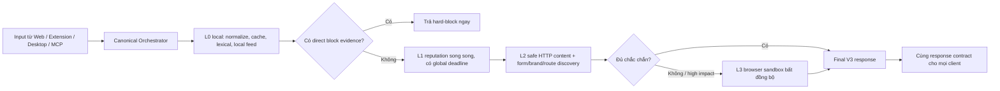

# Risk Detection V3 — thiết kế đánh giá lại URL, Email, SMS và đồng nhất Web/Extension/MCP

**Trạng thái:** Draft để review, chưa triển khai  
**Ngày:** 2026-07-22  
**Phạm vi:** URL, Email, SMS, Risk Core, Web App, Browser Extension, Desktop và MCP

## 1. Kết luận thiết kế

Nhận định “cần đánh giá mạnh hơn” là đúng, nhưng không nên tăng toàn bộ trọng số hoặc hạ ngưỡng một cách đồng loạt. Vấn đề hiện tại gồm bốn phần độc lập:

1. **Bỏ sót bằng chứng trực tiếp:** trang giả Garena có form thu username/password, số điện thoại và OTP nhưng pipeline hiện tại không nhận diện được tổ hợp phishing này.
2. **Score floor quá thấp:** khi có override nguy hiểm, hệ thống thường chỉ đặt đúng sàn 60. Điểm trở thành giá trị ở ranh giới thay vì phản ánh độ mạnh của bằng chứng.
3. **Nhiều hợp đồng verdict khác nhau:** Risk Core V2 coi 60 là dangerous/soft-block; Web và Extension thường chỉ tô đỏ từ 70; legacy policy chỉ block từ 85; một số UI còn dùng điều kiện `score > threshold`, khiến đúng 60 bị ẩn.
4. **Orchestration chậm và khác nhau theo client:** Extension/Web chạy deep HTTP, MCP chạy quick scan không sandbox. Cùng một URL vì vậy có thể vừa bị block ở Web vừa được MCP cho phép.

V3 phải dùng nguyên tắc sau:

> Bằng chứng trực tiếp quyết định mức sàn; model và tín hiệu yếu chỉ hỗ trợ. Mọi client nhận cùng một score, band và policy decision từ một engine duy nhất, không tự suy lại verdict.

## 2. Bằng chứng tái hiện ngày 2026-07-22

URL kiểm thử đã defang:

```text
hxxps://fconline[.]fvplsummercup[.]vn/?q=%3Cscript%3Ealert(1)%3C/script%3E
```

### 2.1 Kết quả hiện tại

| Kênh | Thời gian quan sát | Score | Verdict/decision | Ghi chú |
|---|---:|---:|---|---|
| Web/Extension endpoint `/v1/demo/url/analyze`, deep HTTP | 9.819 ms | 60/100 | dangerous / soft_block | raw score chỉ 7.875; sàn 60 đến từ rule thanh toán/pháp nhân, không phải credential phishing |
| MCP `assess_url` | 12.262 ms | 1.2/100 | safe / ALLOW | chỉ thấy URL percent-encoded; không có sandbox/content traversal |

Đây là lỗi hợp đồng nghiêm trọng: MCP có thể cho agent tiếp tục truy cập trong khi Web đã yêu cầu dừng.

### 2.2 Quan sát thụ động trên trang đích

Không thực thi JavaScript và không gửi form. HTML trả về cho thấy:

- tự nhận là “Garena” và “Giải Đấu FVPL Summer Cup”;
- đường dẫn `/login` dựng giao diện “Garena Account Center” nhưng form thu username/password rồi gửi về endpoint nội bộ `/api/auth/login` trên domain không phải Garena;
- trang chính có luồng thu họ tên, số điện thoại và sau đó yêu cầu OTP;
- các kênh chính thức quan sát được dùng [`account.garena.com`](https://account.garena.com/recovery) cho tài khoản và [`*.fconline.garena.vn`](https://fconline.garena.vn/) cho FC Online, không phải `fvplsummercup.vn`;
- query `q=<script>alert(1)</script>` không được thấy phản chiếu trong HTML trả về. Vì vậy query này là dấu hiệu payload đáng ngờ, nhưng bằng chứng phishing mạnh nằm ở hành vi mạo danh và thu credential/OTP.

Kết luận mong muốn cho trang này là **hard_block, khoảng 90–100**, với reason codes về brand impersonation, unofficial credential form và OTP collection. Không nên giải thích kết quả chủ yếu bằng “tham số URL bất thường”.

Lưu ý: uy tín domain bên ngoài có thể sai hoặc trễ. Tại thời điểm review, [ScamAdviser đánh giá parent domain](https://www.scamadviser.com/check-website/fvplsummercup.vn) là có vẻ an toàn dù cũng ghi nhận shared hosting đáng ngờ. Điều này củng cố yêu cầu không dùng một nguồn reputation làm nguồn chân lý duy nhất.

## 3. Chẩn đoán nguyên nhân

### 3.1 URL

1. Offline URL Core chỉ cộng khoảng 12 điểm cho percent-encoding; không có detector riêng cho XSS/SQLi payload trong query.
2. `deep_analysis=true` hiện dùng HTTP sandbox nhưng không ưu tiên browser sandbox. Trình quét root page không đi theo các đường dẫn cùng site có ý nghĩa cao như `/login`, `/verify`, `/account`, nên bỏ qua form credential.
3. Brand detection chủ yếu dựa vào hostname/path. Nó chưa đối chiếu mạnh `title`, logo, `og:site_name`, nội dung và form với registry domain chính thức của thương hiệu.
4. Direct hazard hiện thường đặt floor 60. `60` là ngưỡng bắt đầu block chứ không phải mức hợp lý cho credential exfiltration đã quan sát.
5. MCP gọi thẳng quick `InferenceService.assess_url`, không có cùng profile thu thập bằng chứng với Extension.
6. Demo route thực hiện thêm domain inspection sau production assessment; nhiều nguồn bên ngoài còn được gọi theo các pha nối tiếp. MCP vì thế vẫn chậm dù kết quả nghèo bằng chứng.

### 3.2 Email và SMS

Không đủ cơ sở để kết luận model text tự thân có “accuracy thấp”. Metadata artifact hiện ghi accuracy khoảng 94,1%, recall khoảng 93,4% trên tập validation chung, nhưng repo cũng ghi rõ chưa có frozen independent holdout tái lập cho **toàn pipeline** Email/SMS. Trải nghiệm thấp chủ yếu có thể đến từ coverage và policy:

- ML không có rule corroboration bị cap ở 25/100; khi có rule, ML chỉ được nâng tối đa thêm 10 điểm. Cơ chế này giảm false positive nhưng dễ bỏ sót scam ngữ nghĩa mới chưa có regex.
- Email và SMS dùng chung text model tổng quát; chưa thấy calibration riêng theo channel, ngôn ngữ, nguồn và loại scam.
- Gmail Extension chỉ gửi `body.innerText`, sender và subject. Cách này làm mất hidden `href`, display-target mismatch, raw HTML, Reply-To, Return-Path và kết quả SPF/DKIM/DMARC.
- Gmail quick scan mặc định chỉ xử lý tối đa một embedded URL bằng offline core. Link quan trọng không nhất thiết đứng đầu.
- Extension chỉ quét riêng file EXE; macro document, archive, PDF active content và QR không được thu thập đầy đủ ở luồng đọc Gmail.
- SMS không có số gửi thì phone reputation luôn unavailable; conversation history chỉ được dùng khi client truyền `conversation_turns`.
- `text`/`chat` không phải SMS hiện rơi vào nhánh rule Email, làm sai modality semantics.
- UI Gmail dùng `score > warningThreshold`; score đúng bằng 60 có thể được hiển thị như an toàn/không vượt ngưỡng.

Vì vậy V3 phải đo lại end-to-end, không dùng chỉ số artifact của classifier để tuyên bố độ chính xác sản phẩm.

## 4. Mục tiêu và phi mục tiêu

### 4.1 Mục tiêu

- Cùng input + policy profile phải cho cùng score/decision trên Web, Extension, Desktop và MCP.
- Confirmed phishing, credential theft, malicious execution hoặc exact threat-feed hit không được bị pha loãng dưới hard-block.
- Quick scan trả lời nhanh bằng local evidence/cache và có deadline cứng.
- Slow/unavailable provider phải làm giảm coverage, không được biến thành “safe”.
- Email/SMS tăng recall bằng cách cải thiện input coverage, modality rules và calibration, nhưng giữ false-positive rate có kiểm soát.
- Mỗi kết quả giải thích được bằng machine-readable reason codes và evidence lineage.

### 4.2 Phi mục tiêu

- Không coi risk score là xác suất website chắc chắn lừa đảo.
- Không tự động kết luận toàn bộ domain độc hại chỉ vì URL chứa chuỗi `<script>` chưa được phản chiếu/thực thi.
- Không bắt MCP chờ mọi provider hoặc browser sandbox hoàn tất.
- Không cho UI/client tự sửa score để tạo cảm giác “mạnh hơn”.

## 5. Hợp đồng Risk V3 duy nhất

Top-level chỉ dùng thang **0..100**. Không dùng đồng thời `risk_score=0..1` và `risk_core.final_score=0..100` dưới cùng tên.

```json
{
  "schema_version": "3.0",
  "assessment_id": "...",
  "subject": { "type": "url", "normalized": "..." },
  "risk_score": 94,
  "risk_band": "critical",
  "decision": "hard_block",
  "confidence": 0.96,
  "finality": "final",
  "coverage": {
    "local": "completed",
    "reputation": "completed",
    "content": "completed",
    "browser": "not_required"
  },
  "reason_codes": [
    "BRAND_IMPERSONATION",
    "UNOFFICIAL_CREDENTIAL_FORM",
    "OTP_COLLECTION"
  ],
  "evidence": [],
  "policy": {
    "profile": "pre_navigation",
    "version": "risk-policy-v3",
    "enforcement": { "proceed": false, "disable_tools": true }
  },
  "timings_ms": { "total": 742, "local": 18, "network": 501 }
}
```

### 5.1 Band và decision chuẩn

| Score | Band | Decision mặc định | Hành động |
|---:|---|---|---|
| 0–19 | low | allow | tiếp tục |
| 20–39 | caution | warn | cảnh báo; có thể deep scan |
| 40–59 | suspicious | require_review | dừng để xác minh/sandbox |
| 60–79 | dangerous | soft_block | không tiếp tục mặc định |
| 80–100 | critical | hard_block | chặn/quarantine/report |

Quy tắc biên luôn dùng `>=`. User-configured warning threshold chỉ điều khiển độ ồn của notification; nó không được che `soft_block`, `hard_block` hoặc direct malicious finding.

Các client phải render `risk_band` và thi hành `decision` từ server. Không gọi lại `getRiskLevel(score)` để tạo một policy khác.

## 6. Scoring: mạnh theo chất lượng bằng chứng, không mạnh theo số lượng từ khóa

### 6.1 Công thức

1. Chuẩn hóa và deduplicate evidence theo `incident_key`, `family`, `subject`.
2. Trong mỗi family, dùng soft-OR có correlation cap để nhiều tín hiệu độc lập tăng score nhưng các biến thể cùng một tín hiệu không double-count:

```text
family_score = 100 × (1 - product(1 - calibrated_strength_i))
base_score   = fusion(family_scores, model_score)
final_score  = max(base_score, strongest_applicable_floor)
```

3. `confidence` tính riêng từ coverage, source authority, freshness và agreement. Không dùng confidence để hạ floor của direct evidence.
4. Model chỉ được hard-block khi có rule/evidence độc lập hỗ trợ. Model có xác suất rất cao nhưng chưa corroborate được phép nâng lên `require_review` 40–59 thay vì bị cap ở 25.

### 6.2 Floor đề xuất

| Bằng chứng | Floor | Decision tối thiểu |
|---|---:|---|
| Exact URL có hit malicious còn hiệu lực từ authoritative feed hoặc consensus độc lập | 95 | hard_block |
| Credential/OTP exfiltration đã quan sát; form credential gửi tới origin không chính thức | 95 | hard_block |
| Brand impersonation + password/OTP form trên domain không thuộc registry chính thức | 90 | hard_block |
| Browser sandbox xác nhận malicious JS, exfiltration, drive-by download | 90 | hard_block |
| XSS payload được phản chiếu vào executable context hoặc thực thi trong sandbox | 85 | hard_block |
| BEC: authority + payment-account change + urgency/secrecy | 90 | hard_block |
| SMS yêu cầu OTP/password, remote-control app hoặc irreversible payment kèm thúc ép | 85 | hard_block |
| Brand mismatch + credential lure nhưng chưa quan sát form/exfiltration | 75 | soft_block |
| XSS/SQLi payload chỉ xuất hiện trong URL, chưa phản chiếu/thực thi | 45 | require_review |
| Percent-encoding hoặc urgency/link đứng riêng | 10–25 | không tự block |

Floor được gắn với versioned rule và evidence IDs. Một tín hiệu weak/contextual không được tạo floor chỉ vì tên criterion chứa chữ “nguy hiểm”.

## 7. Kiến trúc phân tích URL mới



### 7.1 L0 — local fast path, mục tiêu dưới 50 ms

- normalize URL một lần, decode có giới hạn, chống parser differential;
- local threat feed, negative/positive cache, official-brand domain registry;
- lexical deception, dangerous schemes/downloads, injection payload signatures;
- cache key có rules/model/feed version;
- nếu hit direct block, trả ngay mà không chờ network.

### 7.2 L1 — reputation song song, global budget 400–800 ms

- Chỉ gọi provider đã cấu hình.
- Gọi song song, không lặp tuần tự qua 14 adapter.
- Mỗi provider có timeout nhỏ hơn global deadline, circuit breaker và bulkhead.
- Positive malicious cache dài; negative cache ngắn; stale-while-revalidate.
- DNS/RDAP/certificate/domain reputation dùng domain cache dùng chung, không inspect lại trong demo route.
- Một provider timeout tạo `unavailable`, không tạo clean evidence.

### 7.3 L2 — safe content inspection, mục tiêu 0,8–1,5 giây

- Fetch không thực thi script, SSRF guard, chặn private IP, giới hạn redirect/bytes/content type.
- Parse title, favicon, `og:*`, logo hints, forms, password/OTP/card fields, form action, third-party scripts.
- Tạo brand claim từ nội dung rồi đối chiếu official-domain registry.
- Route discovery có giới hạn: từ root ưu tiên tối đa 3 same-origin link có token `login`, `signin`, `account`, `verify`, `auth`, `payment`, `join`.
- Không crawl toàn site. Không submit form.
- Với URL mẫu, route `/login` phải tạo cluster `BRAND_IMPERSONATION + UNOFFICIAL_CREDENTIAL_FORM`; root flow OTP tạo thêm `OTP_COLLECTION`.

### 7.4 L3 — browser sandbox theo nhu cầu

Chỉ chạy khi:

- score 40–79 và coverage chưa đủ;
- có JS-heavy page, client-side redirect/form hoặc shortlink;
- có injection payload cần xác nhận reflection/execution;
- user chọn deep/advanced.

Extension nhận provisional result sớm và được update bằng `assessment_id`. MCP không chờ vô hạn: khi hết deadline, trả `finality=provisional`, coverage rõ ràng và decision bảo thủ `require_review` nếu high-impact evidence chưa được giải quyết.

### 7.5 Profile thời gian

| Profile | Dùng cho | Deadline | Hành vi |
|---|---|---:|---|
| `pre_navigation` | MCP, click interception, extension background | 1,5–2 giây | L0 + bounded L1/L2; trả partial an toàn nếu hết giờ |
| `interactive` | Web/Desktop mặc định | 3–5 giây | chờ L2 đầy đủ, có thể browser theo risk |
| `deep` | người dùng yêu cầu | 8–12 giây | browser sandbox và enrichment mở rộng |

Không client nào tự chọn engine khác; profile chỉ thay đổi deadline/coverage, không thay threshold hoặc scoring rule.

## 8. Email V3

### 8.1 Input contract

Ưu tiên raw MIME từ Gmail API hoặc `.eml`. Nếu Extension không có raw MIME, phải gửi một representation có cấu trúc:

```json
{
  "visible_text": "...",
  "sanitized_html": "...",
  "links": [{ "display": "account.garena.com", "href": "https://evil.example" }],
  "sender": "...",
  "reply_to": "...",
  "subject": "..."
}
```

Không dùng riêng `innerText`, vì nó xóa bằng chứng hidden link. Authentication headers không có thì coverage là `unavailable`, không phải clean.

### 8.2 Pipeline

- Header identity: From/Reply-To/Return-Path/Message-ID và SPF/DKIM/DMARC khi có.
- Display-name/brand impersonation và business email mismatch.
- Phân tích tất cả link đã deduplicate theo mức ưu tiên; URL checks chạy song song dưới shared deadline.
- HTML deception, QR URL, attachment type mismatch, macro/active PDF/archive/EXE.
- BEC/thread/payment change nếu có conversation/business context.
- Model Email riêng, calibration riêng theo tiếng Việt/Anh và loại nguồn; OOD score đi vào confidence/coverage.

Model-only rất mạnh có thể tạo `require_review` nhưng không hard-block. Confirmed malicious URL/file hoặc credential phishing cluster phải tạo floor 90–95.

## 9. SMS V3

- Tách model/calibration SMS khỏi Email; hỗ trợ tiếng Việt không dấu, teencode, zero-width và URL defang/shortener.
- Nếu có sender: chuẩn hóa E.164, country/line type/reputation; nếu không có thì ghi coverage thiếu.
- Conversation window là first-class input, không chỉ metadata tùy chọn.
- Link expansion và URL assessment chạy song song; không chỉ chấm “có link”.
- Rule cluster chính: delivery/debt, task-job deposit, wrong-number investment, authority impersonation, OTP/password, remote-control app, irreversible payment.
- Một từ “gấp”, “trúng thưởng” hoặc số VoIP đứng riêng không được block.
- Sensitive credential request, remote app, known-malicious link hoặc coordinated payment scam phải có floor 85–95.

## 10. MCP V3

`assess_url` và `assess_text` phải gọi Canonical Orchestrator, không gọi trực tiếp một quick service khác với Web.

Yêu cầu response MCP:

- luôn có `risk_score`, `risk_band`, `decision`, `finality`, `coverage`, `reason_codes`, `enforcement`;
- decision là authoritative; agent không tự map lại từ score;
- `proceed=false` cho `require_review`, `soft_block`, `hard_block` trong pre-navigation profile;
- strict global deadline, không chờ adapter tuần tự;
- hỗ trợ `get_assessment(assessment_id)` để lấy enrichment cuối nếu caller cần;
- cache/in-flight dedup dùng chung với API/Extension;
- telemetry phải tách `queue_ms`, `local_ms`, `provider_ms`, `content_ms` để tìm bottleneck thật.

## 11. Benchmark và tiêu chí chấp nhận

### 11.1 Bộ dữ liệu

Tạo frozen, versioned, deduplicated holdout riêng:

- URL: benign phổ biến, benign domain mới, phishing credential, scam payment, malicious download, XSS payload reflected/non-reflected, compromised legitimate site, shortlink/redirect.
- Email: legitimate OTP/security notice, marketing, invoice thật, BEC, credential phishing, QR phishing, attachment phishing, forwarded mail có SPF fail hợp lệ.
- SMS: OTP thật, delivery thật, smishing delivery/debt, task-job, investment, remote app, impersonation, conversation nhiều lượt.
- Ít nhất 40% mẫu tiếng Việt; có biến thể không dấu/obfuscation.
- Tách theo domain/campaign/time để tránh leakage.

Nhãn tối thiểu gồm `malicious`, `suspicious`, `benign`, `unknown` và action label `allow`, `review`, `block`. Hai reviewer độc lập cho tập nhạy cảm; lưu provenance và thời điểm xác minh.

### 11.2 Chỉ số

Không chỉ báo accuracy/F1:

- precision, recall, F1, FPR, FNR theo modality và scam family;
- recall tại fixed FPR;
- confusion matrix theo policy decision;
- calibration ECE/Brier cho model probability;
- direct-threat miss rate;
- cross-client decision agreement;
- coverage completeness và provider availability;
- latency p50/p95/p99, cache hit/miss và timeout rate.

### 11.3 Target phát hành

| Chỉ số | Target |
|---|---:|
| Direct confirmed threat recall | >= 99% |
| URL phishing recall | >= 95% tại FPR <= 2% |
| Email/SMS scam recall | >= 93% |
| Email/SMS precision | >= 92% |
| Web/Extension/Desktop/MCP agreement cùng profile | 100% |
| `pre_navigation` p50 warm/cache | <= 250 ms |
| `pre_navigation` p95 | <= 1,5 giây; hard deadline <= 2 giây |
| Text-only Email/SMS p95 | <= 500 ms |
| Email/SMS có URL p95 | <= 1,5 giây |
| Deep URL p95 | <= 8 giây |

Target chỉ được công bố sau khi harness chạy lại từ artifact thực tế, không lấy số trong metadata làm kết quả release.

### 11.4 Golden acceptance cases

1. URL mẫu FVPL root và `/login`: `risk_score >= 90`, `hard_block`, có brand + credential reason codes.
2. URL chỉ chứa encoded `<script>alert(1)</script>` trên một endpoint không phản chiếu: không tự hard-block; `require_review` nếu chưa xác minh.
3. Payload được phản chiếu/executed trong sandbox: `risk_score >= 85`, hard-block.
4. Cùng URL/profile trên Web, Extension và MCP: score sai khác tối đa 0, decision giống tuyệt đối.
5. Legitimate OTP “không chia sẻ mã”: dưới 40 và không có sensitive-request false positive.
6. SMS yêu cầu gửi OTP, cài APK/AnyDesk hoặc nạp tiền làm nhiệm vụ: >= 85, hard-block.
7. Email giả brand + DMARC fail + hidden credential link: >= 85; hidden href phải được ghi nhận.
8. Provider timeout: coverage unavailable; không được đổi một provisional review/block thành safe.

## 12. Rollout

### P0 — sửa contract và lỗ hổng đồng nhất

- Tạo schema/policy V3 và shared conformance tests.
- Bỏ client-side policy mapping; sửa tất cả biên `>` thành authoritative decision/`>=`.
- Cho MCP gọi cùng orchestrator/profile với Extension.
- Thêm regression test URL mẫu và test score 60 không bị ẩn.

### P1 — URL strong evidence + latency

- Parallel external providers với global deadline/circuit breaker.
- Bỏ domain inspection trùng lặp; shared cache và in-flight dedup.
- Brand registry, credential-form detector, bounded route discovery.
- Progressive result + assessment ID; browser sandbox chỉ theo policy.

### P2 — Email/SMS coverage và calibration

- Structured Gmail input/raw MIME; hidden links và headers.
- Parallel embedded URL assessment; attachment/QR coverage.
- Tách Email/SMS model calibration; nới model-only từ cap 25 lên review band khi đủ confidence/OOD checks.
- Conversation-first SMS và phone coverage rõ ràng.

### P3 — shadow evaluation và release gate

- Chạy V2/V3 song song không thay enforcement trong 1–2 tuần hoặc trên replay corpus.
- Review mọi case V3 tăng từ allow lên block và V2 block xuống allow.
- Chỉ canary enforcement khi đạt target FPR/FNR/latency.
- Version hóa score, reason code, model, rules, feed snapshot để rollback.

## 13. Quyết định cần phê duyệt trước khi implement

1. Dùng policy band V3 `20/40/60/80` làm nguồn chân lý duy nhất.
2. Credential/OTP form trên unofficial brand domain có floor 90; confirmed exfiltration có floor 95.
3. XSS payload chưa phản chiếu chỉ tạo review, không tự gắn nhãn toàn domain là phishing.
4. MCP default `pre_navigation` hard deadline 2 giây và được phép trả provisional conservative decision.
5. Độ chính xác release được đo trên frozen end-to-end holdout; không dùng metadata classifier làm tuyên bố sản phẩm.

Nếu năm quyết định này được duyệt, thứ tự triển khai nên là **P0 → P1 → benchmark URL → P2 → benchmark Email/SMS → P3**, thay vì chỉnh weight rời rạc ở từng client.
