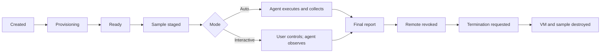

# Windows Cloud Lab: Auto Analyze và Interactive Investigate

## Quan hệ với Local Shield

Local Shield là lớp **local-first**, không phải một giao diện phụ thuộc hoàn toàn vào
cloud:

1. đọc metadata, SHA-256 và chữ ký Authenticode mà không chạy file;
2. theo dõi Downloads, tạo bản sao cách ly và mở Windows Sandbox cục bộ khi hệ
   điều hành hỗ trợ;
3. chỉ khi người dùng chủ động đồng ý, handoff đúng file đã chọn sang Windows
   Cloud Lab để phân tích sâu hơn.

Trước khi handoff, Electron chỉ cho renderer đọc file vừa được người dùng chọn,
kiểm tra lại SHA-256 để chống thay file sau lần quét và áp giới hạn 10 MB. Vì vậy,
cloud là tầng escalation dùng chung của Web Lab và Local Shield, không phải điểm
lỗi duy nhất của bảo vệ cục bộ.

## Hai chế độ

| Chế độ | Hành vi | Thời gian | Remote desktop |
| --- | --- | --- | --- |
| Auto Analyze | Agent tự chạy đúng một mẫu trong 60–120 giây, thu telemetry có giới hạn rồi yêu cầu hủy VM ngay sau báo cáo cuối | Lease PRO/MAX theo cấu hình, nhưng VM được dọn sớm khi phân tích xong | Không cấp |
| Interactive Investigate | Agent chỉ đặt mẫu vào `C:\Prewise\Sample`; người dùng tự quyết định có chạy hay không và agent quan sát trong suốt lượt | 5 hoặc 10 phút | Có, nhưng chỉ qua broker riêng khi hạ tầng thật sự sẵn sàng |

Agent v2 thu cây tiến trình, command line đã che secret, thay đổi file trong vùng
giám sát, các khóa persistence HKLM/HKCU/HKU, kết nối mạng gắn với PID và mốc
thời gian. Screenshot chỉ được dùng tạm để tạo metadata/hash rồi pixel bị xóa;
file, registry value, screenshot và credential không được đưa vào report.

## Lifecycle



- Đồng hồ điều khiển chỉ bắt đầu tại `readyAt`; trước đó `expiresAt` chỉ là hard
  provisioning deadline.
- `leaseExpiresAt = readyAt + 5/10 phút` cho Interactive.
- Agent chỉ tải mẫu sau khi backend đã chuyển phiên sang `ready`, nên thời gian
  quan sát không chạy trước thời gian điều khiển của người dùng.
- Khi hết lease, input remote bị thu hồi ngay. Backend dành tối đa 15 giây chỉ để
  agent gửi telemetry cuối, sau đó xác nhận EC2 đã terminate.
- `DELETE` trả nhanh với `termination_requested`; client poll đến
  `terminated`, `expired` hoặc `cleanup_failed`. Không báo “đã hủy” trước khi AWS
  xác nhận.
- Windows còn có hard self-destruct bằng `shutdown.exe` và
  `InstanceInitiatedShutdownBehavior=terminate` nếu backend bị gián đoạn.

## API phiên

```text
GET    /v1/sandbox-cloud/status
POST   /v1/sandbox-cloud/sessions
GET    /v1/sandbox-cloud/sessions/{session_id}
DELETE /v1/sandbox-cloud/sessions/{session_id}
POST   /v1/sandbox-cloud/sessions/{session_id}/exe
POST   /v1/sandbox-cloud/sessions/{session_id}/remote-access
POST   /v1/sandbox-cloud/broker/remote-access/consume
```

Payload tạo phiên:

```json
{"tier":"pro","mode":"auto"}
```

```json
{"tier":"pro","mode":"interactive","leaseMinutes":5}
```

`leaseMinutes` chỉ hợp lệ với Interactive và chỉ nhận `5` hoặc `10`.
`GET /status` trả riêng phiên đang hoạt động và phiên hoàn tất gần nhất để bằng
chứng Auto không biến mất sau khi VM được dọn.

## Remote access không công khai RDP

EC2 không có public IP. Auto dùng security group không inbound; Interactive dùng
AMI và security group riêng, chỉ cho gateway/broker private kết nối. Prewise không
trả RDP username/password cho browser.

Khi người dùng bấm kết nối, backend mới phát hành một opaque token:

- gắn với user và session;
- lưu server-side dưới dạng SHA-256;
- dùng đúng một lần qua phép cập nhật atomic;
- mặc định hết hạn sau 60 giây, có thể cấu hình trong khoảng 15–300 giây, và
  luôn hết hạn sớm hơn nếu lease sắp hết;
- bị thu hồi ngay khi phiên dừng hoặc hết hạn.

Web chỉ dựng iframe cho `connectUrl` HTTPS đã kiểm tra và sandbox iframe không có
quyền top-navigation, popup, download hay clipboard. Nếu AMI/broker/DCV chưa cấu
hình, API trả `interactiveAvailable=false`/HTTP 503 và UI báo fail-visible; tuyệt
đối không tạo URL hoặc màn hình RDP giả.

Broker có thể triển khai bằng Amazon DCV hoặc Apache Guacamole, nhưng phải:

1. ở trong private network có quyền tới Interactive security group;
2. gọi endpoint `consume` với `X-Sandbox-Broker-Secret`;
3. khóa kết nối theo `providerInstanceId` backend trả về;
4. áp lease server-side và CSP `frame-ancestors` chỉ cho origin Prewise;
5. không ghi query token vào access log.

## Quyền sử dụng và credit

Sandbox Cloud dùng hai lớp quyền:

1. Gói tài khoản mở tier: Free chỉ có Safe Browser local; Pro mở Windows PRO;
   Team ánh xạ thành MAX.
2. Credit trả chi phí mỗi phiên: PRO 1 credit, MAX 3 credit. Auto kết thúc sớm
   vẫn tính một lượt sau khi VM usable; provisioning thất bại được hoàn credit
   tối đa một lần.

Giá demo hiện tại là 5.000đ/credit. Gói PRO 5.000đ tặng 2 credit; gói TEAM/MAX
29.000đ tặng 6 credit. Thanh toán dùng SePay với reference riêng, số tiền cố định,
thời hạn QR, xác minh HMAC/API key và chống tái sử dụng transaction ID.

## Cấu hình bắt buộc

```env
AWS_REGION=ap-southeast-1
AWS_SANDBOX_SUBNET_ID=

# Auto AMI + SG private/NAT egress, không inbound
AWS_SANDBOX_AMI_ID=
AWS_SANDBOX_INSTANCE_TYPE=m7i-flex.large
AWS_SANDBOX_MAX_AMI_ID=
AWS_SANDBOX_MAX_INSTANCE_TYPE=g4dn.xlarge
AWS_SANDBOX_SECURITY_GROUP_ID=

# Interactive AMI + SG chỉ nhận traffic từ private broker
AWS_SANDBOX_INTERACTIVE_AMI_ID=
AWS_SANDBOX_INTERACTIVE_MAX_AMI_ID=
AWS_SANDBOX_INTERACTIVE_INSTANCE_TYPE=m7i-flex.large
AWS_SANDBOX_INTERACTIVE_MAX_INSTANCE_TYPE=g4dn.xlarge
AWS_SANDBOX_INTERACTIVE_SECURITY_GROUP_ID=

# Chọn broker template hoặc EC2 tag; template chỉ nhận hai placeholder này
SANDBOX_REMOTE_BROKER_URL_TEMPLATE=https://broker.example/session/{session_id}/{instance_id}
AWS_SANDBOX_REMOTE_URL_TAG=
SANDBOX_REMOTE_BROKER_SECRET=<at-least-32-random-bytes>
SANDBOX_REMOTE_ACCESS_TOKEN_TTL_SECONDS=60
SANDBOX_AGENT_REPORT_GRACE_SECONDS=15
SANDBOX_CLOUD_PROVISION_TIMEOUT_MINUTES=10
SANDBOX_PUBLIC_BASE_URL=https://api.example
SANDBOX_SAMPLE_STORAGE_PATH=/app/.aisec-data/cloud-sandbox-samples

PRO_SANDBOX_SESSION_MINUTES=15
MAX_SANDBOX_SESSION_MINUTES=30
```

Auto và Interactive phải dùng hai image profile riêng. Interactive AMI cần remote
server/broker connector đã harden; cả hai AMI cần agent v2, IMDSv2, EBS mã hóa,
không chứa long-lived AWS credential và có egress policy dành riêng cho callback
và nguồn test được phê duyệt.

Mẫu chờ agent tải hiện nằm trên filesystem riêng của backend. Cấu hình Compose
production gắn đường dẫn này vào `tmpfs` private, `noexec`, nên triển khai hiện
tại dùng một backend replica. Nếu scale nhiều replica, phải thay bằng object
storage mã hóa hoặc shared volume private có cơ chế cấp quyền một lần; không được
đặt thư mục mẫu trên web root hay filesystem chỉ đọc mặc định của container.

## Egress bắt buộc khi VM không có public IP

`AssociatePublicIpAddress=False` là ranh giới an toàn có chủ đích và không nên
đổi thành `True` chỉ để làm demo. Với cấu hình này, một route `0.0.0.0/0` tới
Internet Gateway (`igw-*`) **không đủ**: Windows worker không có public IPv4 để
Internet Gateway NAT. Subnet của worker phải có route mặc định tới **public NAT
Gateway** (`nat-*`) hoặc một outbound proxy/firewall tương đương; NAT nằm trong
public subnet có route tới Internet Gateway. AWS mô tả đúng mô hình này tại
[NAT gateways](https://docs.aws.amazon.com/vpc/latest/userguide/vpc-nat-gateway.html)
và [internet access cho subnet](https://docs.aws.amazon.com/vpc/latest/userguide/working-with-igw.html).

Preflight trước mỗi ca E2E phải xác nhận, không chỉ suy ra từ trạng thái EC2:

1. effective route table của subnet (kể cả main route table khi subnet không có
   association riêng) có `0.0.0.0/0 -> nat-*` ở trạng thái active;
2. Auto security group có **0 inbound rule** và cho outbound TCP 443 tới HTTPS
   callback; nếu egress bị giới hạn thì DNS tới VPC resolver cũng phải hoạt động;
3. network ACL không chặn HTTPS outbound, DNS hoặc return traffic ephemeral;
4. `SANDBOX_PUBLIC_BASE_URL` resolve được và trả HTTPS hợp lệ từ chính private
   subnet; kiểm tra từ laptop/backend không chứng minh đường mạng của VM;
5. backend chỉ chuyển phiên sang `ready` sau tín hiệu agent bootstrap/heartbeat,
   không dùng riêng `instance_running` hay `instance_status_ok` làm bằng chứng.

Security group là stateful nhưng network ACL là stateless. Nếu chỉ mở outbound
443 ở security group mà subnet không có NAT route, agent vẫn không thể tải
bootstrap hoặc gửi report. Ngược lại, không cần và không được mở RDP/WinRM/inbound
từ Internet cho Auto worker.

### Quick Tunnel chỉ dành cho demo

Hostname `*.trycloudflare.com` chỉ được dùng trong ca phát triển có giám sát.
Cloudflare nói rõ Quick Tunnel không có SLA, có giới hạn và không dành cho
production trong [tài liệu TryCloudflare](https://developers.cloudflare.com/cloudflare-one/networks/connectors/cloudflare-tunnel/do-more-with-tunnels/trycloudflare/).
Production phải dùng named/managed tunnel hoặc gateway HTTPS có hostname ổn định,
TLS hợp lệ, access log đã che credential và health monitoring. Security group
không lọc được hostname; muốn allow-list theo FQDN cần outbound proxy/firewall,
không hard-code IP tạm thời của Quick Tunnel.

### IAM read-only tối thiểu cho preflight và chẩn đoán

Các API `Describe*` dùng cho network preflight cần `Resource: "*"`; giới hạn
bằng Region và dùng role riêng. Chính sách tối thiểu có thể tách như sau (thay
`<account-id>`):

```json
{
  "Version": "2012-10-17",
  "Statement": [
    {
      "Sid": "PrewiseSandboxNetworkPreflight",
      "Effect": "Allow",
      "Action": [
        "ec2:DescribeInstances",
        "ec2:DescribeInstanceStatus",
        "ec2:DescribeSubnets",
        "ec2:DescribeRouteTables",
        "ec2:DescribeSecurityGroups"
      ],
      "Resource": "*",
      "Condition": {
        "StringEquals": {"aws:RequestedRegion": "ap-southeast-1"}
      }
    },
    {
      "Sid": "PrewiseSandboxTaggedInstanceDiagnostics",
      "Effect": "Allow",
      "Action": "ec2:DescribeInstanceAttribute",
      "Resource": "arn:aws:ec2:ap-southeast-1:<account-id>:instance/*",
      "Condition": {
        "StringEquals": {"aws:RequestedRegion": "ap-southeast-1"},
        "Null": {"ec2:ResourceTag/PrewiseSession": "false"}
      }
    },
    {
      "Sid": "PrewiseSandboxConsoleDiagnostics",
      "Effect": "Allow",
      "Action": "ec2:GetConsoleOutput",
      "Resource": "*",
      "Condition": {
        "StringEquals": {"aws:RequestedRegion": "ap-southeast-1"}
      }
    }
  ]
}
```

`DescribeInstanceAttribute` có thể đọc `userData`, mà bootstrap hiện chứa token
ngắn hạn. Chỉ cấp statement chẩn đoán cho operator/break-glass role, không cho
frontend hay agent, không ghi raw user-data/console output vào log hoặc ticket,
và thu hồi sau ca E2E. Tài liệu AWS về
[EC2 Describe permissions](https://docs.aws.amazon.com/AWSEC2/latest/UserGuide/iam-policies-for-amazon-ec2.html),
[Windows console output](https://docs.aws.amazon.com/AWSEC2/latest/UserGuide/win-ts-common-issues.html)
và [user data](https://docs.aws.amazon.com/AWSEC2/latest/UserGuide/user-data.html)
mô tả các API và rủi ro dữ liệu tương ứng.

### Ma trận test cần khóa trước demo

- Unit: private subnet + NAT + egress 443 được chấp nhận; IGW-only, thiếu default
  route, SG chặn 443 và `UnauthorizedOperation` đều phải fail-visible.
- Unit: preflight tìm main route table nếu subnet không có association riêng và
  không bao giờ in user-data, token, access key hay console output thô.
- Integration: thứ tự bằng chứng phải là `EC2 health -> agent bootstrap -> sample
  download -> staged/running -> final report -> termination confirmed`.
- Negative E2E: tắt đường callback phải giữ phiên khỏi `ready`, hoàn credit nếu
  chưa usable và vẫn xác nhận terminate; không để lease âm thầm trôi.
- Demo E2E: Auto security group giữ 0 inbound rule, instance không có public IP,
  callback HTTPS nhận đủ bootstrap/download/report và VM kết thúc ở trạng thái
  terminal đã được AWS xác nhận.

## Điều kiện để tuyên bố tính năng đã chạy thật

Code hiện đã có contract, lifecycle, telemetry, one-time remote token, migration,
UI fail-visible và test tự động. Tuy nhiên chỉ được trình bày “điều khiển desktop
thật” sau khi đội đã cấu hình Interactive AMI + private broker và ghi được bằng
chứng một phiên end-to-end. Không nên tuyên bố “thay thế Windows 11 Pro”, “cùng
hiệu năng” hoặc “hỗ trợ Windows 7” nếu chưa có benchmark và ma trận tương thích.
